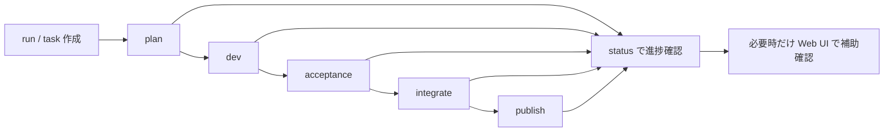

# shipyard-cp


`shipyard-cp` は、複数の AI provider / worker を有限ネストで上流オーケストレーションする control plane です。  
LiteLLM を推論ゲートウェイとして使い、Codex / Claude Code / Google Antigravity / GLM-5 系ワーカーを、共通の task / run / gate / audit モデル上で制御します。

このプロダクトの本体は backend / worker / CLI です。  
frontend は補助UIとして、task と run の閲覧、状態確認、補助操作を行います。

## 3分で分かる最短操作例

まずは backend を起動して、CLI から task を流し、状態を見るだけで全体像が掴めます。

```bash
pnpm install
pnpm run dev
curl http://localhost:3000/healthz
```

その後は Claude Code / Codex から次の入口を使う想定です。

1. task を流す: [run コマンド](./.claude/commands/run.md)
2. 状態を確認する: [status コマンド](./.claude/commands/status.md)
3. フロー全体を追う: [pipeline コマンド](./.claude/commands/pipeline.md)

迷ったら、正本ハブの [CLI Usage](./docs/cli-usage.md) から始めてください。
コマンドの役割だけ先に見たい場合は [`.claude/commands` 入口](./.claude/commands/README.md) を参照してください。

## CLI フロー図



## 何を解決するアプリか

AI コーディングエージェントを実務で使い始めると、すぐに次の問題が出ます。

- どの task が今どこまで進んでいるか分からない
- plan / dev / acceptance の区切りが曖昧で、結果だけ返ってきて途中経過が追えない
- Codex、Claude Code、他の worker で入出力や癖が違い、運用がばらつく
- agent に agent を呼ばせるような構成で、委譲の深さや責務境界が曖昧になりやすい
- 失敗時に再実行、保留、accept 判定、publish 判断を人が場当たりで処理してしまう
- GitHub や tracker とつながっていても、状態と成果物の紐付けが散らばる

`shipyard-cp` は、この「AI worker を実務フローに載せた時の運用の散らかり」を整理するための control plane です。

具体的には、次をまとめて面倒を見ます。

- 複数 provider / worker を単一の上流 orchestrator から扱う
- 無限委譲ではなく有限ネストを前提にして、task の深さと責務を制御する
- task を `plan -> dev -> acceptance -> integrate -> publish` の明示的な段階に分ける
- worker ごとの差を吸収して、共通の `WorkerJob` / `WorkerResult` 契約で扱う
- retry / lease / heartbeat / capability gate を control plane 側に寄せる
- task、run、timeline、audit を残して「何が起きたか」を後から追えるようにする
- `agent-taskstate-js`、`memx-resolver-js`、`tracker-bridge-js` を通じて、状態・文書・tracker の参照先をつなぐ

要するに、単に「AI にコードを書かせる」ためのツールではなく、複数の worker を有限ネストで束ねながら、実務フローに載せるための上流 control plane です。

## 運用方針

- 主導線: CLI / Claude Code / Codex
- 補助導線: Web UI
- 内部契約: API / OpenAPI / schema

人が日常的に触る入口は API 直打ちではなく CLI-first です。  
API は UI 接続、内部契約、自動化、検証用として維持しています。

## 最初の入口

まずはここから見れば十分です。

1. [CLI Usage](./docs/cli-usage.md)
2. [run コマンド](./.claude/commands/run.md)
3. [status コマンド](./.claude/commands/status.md)
4. 必要なら [pipeline コマンド](./.claude/commands/pipeline.md)
5. 実装や運用の現在値は [RUNBOOK](./docs/project/RUNBOOK.md)

## クイックスタート

```bash
pnpm install
pnpm run dev
```

疎通確認:

```bash
curl http://localhost:3000/healthz
```

補助UI を使う場合:

- UI: `http://localhost:8080`
- API: `http://localhost:3000`

## CLI での使い方

日常運用は [docs/cli-usage.md](./docs/cli-usage.md) を正本にします。

よく使う入口:

- 単発 task を流す: [run.md](./.claude/commands/run.md)
- 状態を確認する: [status.md](./.claude/commands/status.md)
- フルフローを追う: [pipeline.md](./.claude/commands/pipeline.md)
- コマンドの違いを先に掴む: [commands README](./.claude/commands/README.md)

補足:

- `.claude/commands/` は product runtime の一部ではなく、Claude Code 用の運用補助コマンド集です
- API 直打ちはデバッグや検証時に限定するのを推奨します

## 運用 Skills

Codex / Claude Code 向けの運用 Skills は [skills](./skills) に置いています。

- [shipyard-cp-cli-quickstart](./skills/shipyard-cp-cli-quickstart/SKILL.md)
- [shipyard-cp-cli-pipeline](./skills/shipyard-cp-cli-pipeline/SKILL.md)

Skills は product の API 契約ではなく、repo を扱う人向けの運用ガイドです。

## アーキテクチャ概要

```text
shipyard-cp
├─ src/                  backend / control plane 本体
├─ web/                  補助UI
├─ packages/             内蔵 npm packages
│  ├─ agent-taskstate-js
│  ├─ memx-resolver-js
│  ├─ tracker-bridge-js
│  └─ shared-redis-utils
├─ infra/                Docker / compose / kubernetes / TLS
├─ docs/                 要件・運用・仕様・CLIハブ
└─ skills/               Codex / Claude Code 向け運用 Skills
```

主要な責務:

- `src/`: state machine、dispatch、result orchestration、acceptance / integrate / publish、monitoring
- `web/`: task / run の閲覧、補助操作、接続確認
- `packages/`: 状態・resolver・tracker の埋め込み依存
- `infra/`: compose、Dockerfile、Kubernetes TLS 資材

## Web UI の位置づけ

Web UI は「主役」ではなく「補助UI」です。

- task / run の閲覧
- 状態確認
- 補助的な dispatch / acceptance 完了などの操作

CLI や worker フローが本命で、frontend はそれを邪魔しない軽い導線として扱います。  
詳細は [web/README.md](./web/README.md) と [web/FRONTEND_RUNBOOK.md](./web/FRONTEND_RUNBOOK.md) を参照してください。

## 最小環境変数

ローカル起動の最低限:

- `.env` または環境変数
- `REDIS_URL`（Redis を使う場合）

外部連携で必要になりやすいもの:

- `OPENAI_API_KEY`
- `ANTHROPIC_API_KEY`
- `GOOGLE_API_KEY`
- `GITHUB_TOKEN`
- `GLM_API_KEY`

ライブテストや publish 系では、必要なキーだけ個別に追加してください。

## インフラ資材

- compose: [infra/docker-compose.yml](./infra/docker-compose.yml)
- production compose: [infra/docker/docker-compose.yml](./infra/docker/docker-compose.yml)
- backend Dockerfile: [infra/docker/api.Dockerfile](./infra/docker/api.Dockerfile)
- k8s / TLS: [infra/kubernetes/tls](./infra/kubernetes/tls)

## ドキュメント

主要ドキュメント:

- [CLI Usage](./docs/cli-usage.md): CLI-first 運用の正本ハブ
- [REQUIREMENTS](./docs/project/REQUIREMENTS.md): 要件定義
- [RUNBOOK](./docs/project/RUNBOOK.md): 実装・運用の現在値
- [State Machine](./docs/state-machine.md): 状態遷移仕様
- [API Contract](./docs/api-contract.md): API 契約
- [OpenAPI](./docs/openapi.yaml): OpenAPI 3.1
- [Schemas](./docs/schemas): JSON Schema 一覧
- [BIRDSEYE](./docs/BIRDSEYE.md): 文書間ナビゲーション

## テストと品質

日常的に使うコマンド:

```bash
pnpm test
pnpm run build
cd web && npm test
cd web && npm run build
```

ライブテストは外部 API トークンが必要です。  
token 類は `.env` や環境変数で管理し、repo に直接入れない運用を前提としています。

## API について

API は残っていますが、位置づけは internal contract です。

- UI 接続
- 自動化
- worker / result 反映
- デバッグ / 検証

通常運用では [docs/cli-usage.md](./docs/cli-usage.md) の CLI 導線を優先してください。
