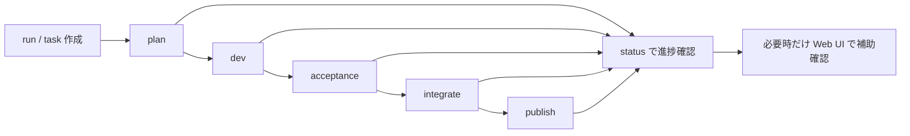

# shipyard-cp

日本語版 | [English](./README_en.md)


`shipyard-cp` は、複数の AI provider / worker を有限ネストで上流オーケストレーションする control plane です。  
LiteLLM を推論ゲートウェイとして使い、Codex / Claude Code / Google Antigravity / GLM-5 系ワーカーを、共通の task / run / gate / audit モデル上で制御します。

このプロダクトの本体は backend / worker / CLI です。  
frontend は補助UIとして、task と run の閲覧、状態確認、補助操作を行います。
配布物は署名・SBOM・provenance付きのコンテナイメージです。shipyard-cp自身はstaging/productionへデプロイせず、
利用者が自身の環境へデプロイし、rollbackと運用監視を担当します。


## 3分で分かる最短操作例

まずは backend を起動して、CLI から task を流し、状態を見るだけで全体像が掴めます。

```bash
pnpm install
pnpm run dev
curl http://localhost:3100/healthz
```

その後は Claude Code / Codex から次の入口を使う想定です。

1. task を流す: [run コマンド](./.claude/commands/run.md)
2. 状態を確認する: [status コマンド](./.claude/commands/status.md)
3. フロー全体を追う: [pipeline コマンド](./.claude/commands/pipeline.md)

迷ったら、正本ハブの [CLI Usage](./docs/cli-usage.md) から始めてください。
コマンドの役割だけ先に見たい場合は [`.claude/commands` 入口](./.claude/commands/README.md) を参照してください。
GLM5 を主線にする場合は [GLM5 Quickstart](./docs/glm5-quickstart.md) を合わせて確認してください。
実運用向けの詳細手順は [GLM5 Operation Instructions](./docs/glm5-operation-instructions.md) を参照してください。
Shipyard-cp管理のcredentialを複製せずsanitized advisoryだけを呼ぶ場合は [CLI Usageのbounded GLM advisory bridge](./docs/cli-usage.md#bounded-glm-advisory-bridge) を参照してください。
[LM Studio / LM Link Quickstart](./docs/lmstudio-lmlink-quickstart.md) はローカル OpenAI 互換 APIを低リスク plan/dev に使う場合の入口です。
セキュリティ計画と受け入れ条件は [Security Docs](./docs/security/README.md) を参照してください。

runtimeのGate評価と明示的Evidence review ackは、`self-improvement/v1`のsanitized observationとしてexportできます。契約正本はworkflow-cookbook、shipyard-cpはAuditを正本にするproducerです。操作は [CLI Usage](./docs/cli-usage.md#自己改善観測とevidence-ack) を参照してください。

## CLI フロー図


```mermaid
flowchart LR
    A["run / task 作成"] --> B["plan"]
    B --> C["dev"]
    C --> D["acceptance"]
    D --> E["integrate"]
    E --> F["publish"]
    B --> S["status で進捗確認"]
    C --> S
    D --> S
    E --> S
    F --> S
    S --> U["必要時だけ Web UI で補助確認"]
```

## Latest Release

### v0.5.0

production向けRedis永続化、self-improvement Observation export / Evidence ack、
低リスクのLM Studio routingを追加したminor releaseです。

互換性、非対象範囲、検証証跡は
[v0.5.0 release note](./docs/releases/v0.5.0.md)を参照してください。

### 2026-06-23: OpenCode-Compatible Worker Runtime

MIT版OpenCodeの session / tool / event 設計をShipyardのControl Plane側へ移植し、`WorkerRuntimeSession` として共通runtime contractを追加しました。詳細は [OpenCode-Compatible Worker Runtime release note](./docs/releases/2026-06-23-opencode-compatible-runtime.md) を参照してください。

主な追加機能:
- Durable input admission と session event replay
- Scoped tool registry と stale tool registration拒否
- Tool output bounding と retained artifact参照
- OpenCode event streamのruntime-neutral正規化
- QEG `standard` profileでの証跡付きGo

### v0.2.0

主な追加機能:
- Session reuse with same-stage policy
- Agent-aware session profiles (planning/build/verification)
- Warm pool for idle session optimization
- Event stream tracking and orphan recovery

## 何を解決するアプリか

AI コーディングエージェントを実務で使い始めると、すぐに次の問題が出ます。

- どの task が今どこまで進んでいるか分からない
- plan / dev / acceptance の区切りが曖昧で、結果だけ返ってきて途中経過が追えない
- Codex、Claude Code、他の worker で入出力や癖が違い、運用がばらつく
- agent に agent を呼ばせるような構成で、委譲の深さや責務境界が曖昧になりやすい
- 失敗時に再実行、保留、accept 判定、publish 判断を人が場当たりで処理してしまう
- GitHub や tracker とつながっていても、状態と成果物の紐付けが散らばる

`shipyard-cp` は、この「AI worker を実務フローに載せた時の運用の散らかり」を整理するための control plane です。

具体的には、次をまとめて面倒を見ます。

- 複数 provider / worker を単一の上流 orchestrator から扱う
- 無限委譲ではなく有限ネストを前提にして、task の深さと責務を制御する
- task を `plan -> dev -> acceptance -> integrate -> publish` の明示的な段階に分ける
- worker ごとの差を吸収して、共通の `WorkerJob` / `WorkerResult` 契約で扱う
- retry / lease / heartbeat / capability gate を control plane 側に寄せる
- task、run、timeline、audit を残して「何が起きたか」を後から追えるようにする
- `agent-taskstate-js`、`memx-resolver-js`、`tracker-bridge-js` を通じて、状態・文書・tracker の参照先をつなぐ

要するに、単に「AI にコードを書かせる」ためのツールではなく、複数の worker を有限ネストで束ねながら、実務フローに載せるための上流 control plane です。

## 運用方針

- 主導線: 実行可能な `shipyard` CLI
- 補助導線: Web UI
- 内部契約: API / OpenAPI / schema

人が日常的に触る入口はroot packageと配布コンテナに同梱した `shipyard` CLIです。`.claude/commands/` はCLIを呼ぶClaude Code / Codex向けラッパーです。
API は UI 接続、内部契約、自動化、検証用として維持しています。

## 最初の入口

まずはここから見れば十分です。

1. [CLI Usage](./docs/cli-usage.md)
2. [GLM5 Quickstart](./docs/glm5-quickstart.md)
3. [GLM5 Operation Instructions](./docs/glm5-operation-instructions.md)
4. [Security Docs](./docs/security/README.md)
5. [run コマンド](./.claude/commands/run.md)
6. [status コマンド](./.claude/commands/status.md)
7. 必要なら [pipeline コマンド](./.claude/commands/pipeline.md)
8. 実装や運用の現在値は [RUNBOOK](./docs/project/RUNBOOK.md)

## クイックスタート

```bash
pnpm install
pnpm run dev
```

疎通確認:

```bash
curl http://localhost:3100/healthz
```

補助UI を使う場合:

- UI: `http://localhost:8080`
- API: `http://localhost:3100`

## Claude Code / Codex コマンドでの使い方

日常運用は [docs/cli-usage.md](./docs/cli-usage.md) を正本にします。

よく使う入口:

- 単発 task を流す: [run.md](./.claude/commands/run.md)
- 状態を確認する: [status.md](./.claude/commands/status.md)
- フルフローを追う: [pipeline.md](./.claude/commands/pipeline.md)
- コマンドの違いを先に掴む: [commands README](./.claude/commands/README.md)

補足:

- `.claude/commands/` はcurlを直接実装せず、product runtimeの `shipyard` CLIを案内します
- API 直打ちはデバッグや検証時に限定するのを推奨します

## 運用 Skills

Codex / Claude Code 向けの運用 Skills は [skills](./skills) に置いています。

- [shipyard-cp-cli-quickstart](./skills/shipyard-cp-cli-quickstart/SKILL.md)
- [shipyard-cp-cli-pipeline](./skills/shipyard-cp-cli-pipeline/SKILL.md)

Skills は product の API 契約ではなく、repo を扱う人向けの運用ガイドです。

## アーキテクチャ概要

```text
shipyard-cp
├─ src/                  backend / control plane 本体
├─ web/                  補助UI
├─ packages/             内蔵 npm packages
│  ├─ agent-taskstate-js
│  ├─ memx-resolver-js
│  ├─ tracker-bridge-js
│  └─ shared-redis-utils
├─ infra/                Docker / compose / kubernetes / TLS
├─ docs/                 要件・運用・仕様・CLIハブ
└─ skills/               Codex / Claude Code 向け運用 Skills
```

主要な責務:

- `src/`: state machine、dispatch、result orchestration、acceptance / integrate / publish、monitoring
- `src/domain/worker/`: WorkerAdapter契約、session reuse、event stream正規化、orphan recovery
- `src/domain/worker-runtime/`: OpenCode-compatible session / tool registry / event replay / output bounding の共通runtime contract
- `src/infrastructure/`: server manager、session executor、fallback制御
- `web/`: task / run の閲覧、補助操作、接続確認
- `packages/`: 状態・resolver・tracker の埋め込み依存
- `infra/`: compose、Dockerfile、Kubernetes TLS 資材

### Worker Execution Architecture (内部実装)

Codex / Claude Code workerは内部でOpenCode serve/session reuseを使用。詳細は [OpenCode Specification](./docs/project/OPENCODE_SPECIFICATION.md) 参照。

概要:
- **Session reuse**: 同一条件でsession再利用（same-stageのみ）
- **Warm pool**: idle session事前validation
- **Event stream**: transcript/tool_use/permission_request追跡
- **Orphan recovery**: timeout/crash時自動cleanup

外部API契約は維持。public logical worker typeは`codex` / `claude_code` / `google_antigravity`のままです。GLM-5は`CLAUDE_WORKER_BACKEND=glm`で`claude_code`に割り当てるbackendであり、CLIの`--worker glm_5`だけは後方互換aliasとして`claude_code`へ正規化されます。

## Web UI の位置づけ

Web UI は「主役」ではなく「補助UI」です。

- task / run の閲覧
- 状態確認
- 補助的な dispatch / acceptance 完了などの操作

CLI や worker フローが本命で、frontend はそれを邪魔しない軽い導線として扱います。  
詳細は [web/README.md](./web/README.md) と [web/FRONTEND_RUNBOOK.md](./web/FRONTEND_RUNBOOK.md) を参照してください。

## 最小環境変数

ローカル起動の最低限:

- `.env` または環境変数
- `REDIS_URL`（開発時は任意、productionでは必須）
- productionでは`STORE_BACKEND=redis`を必須とし、Redis接続失敗時にmemoryへfallbackしません。`/healthz`はlivenessとして200を保ち、`/health/ready`と状態APIはRedis障害中に503になります。
- Redis key namespaceは`${REDIS_KEY_PREFIX}v2:`であり、v0.4系のmemory状態・旧keyは自動移行しません。

外部連携で必要になりやすいもの:

- `OPENAI_API_KEY`
- `ANTHROPIC_API_KEY`
- `GOOGLE_API_KEY`
- `GITHUB_TOKEN`
- `GLM_API_KEY`

ライブテストや publish 系では、必要なキーだけ個別に追加してください。

### LM Studio / LM Link

`LMSTUDIO_ENABLED=true` とモデル名を設定すると、`codex` / `claude_code` の low-risk `plan` / `dev` を LM Studio の `/v1` OpenAI互換 APIへ送れます。LM Link使用時も shipyard-cp の接続先は同じ LM Studio APIです。
コンテナからホストのLM Studioへ接続する場合は `LMSTUDIO_BASE_URL=http://host.docker.internal:1234/v1` を使います。モデルのload/unloadやLM Linkのremote device選択はLM Studio側で行い、shipyard-cpは操作しません。


## インフラ資材

- compose: [infra/docker-compose.yml](./infra/docker-compose.yml)
- production compose: [infra/docker/docker-compose.yml](./infra/docker/docker-compose.yml)
- backend Dockerfile: [infra/docker/shipyard-cp/Dockerfile](./infra/docker/shipyard-cp/Dockerfile)
- k8s / TLS: [infra/kubernetes/tls](./infra/kubernetes/tls)

## ドキュメント

主要ドキュメント:

- [CLI Usage](./docs/cli-usage.md): Claude Code / Codex コマンド経由運用の正本ハブ
- [REQUIREMENTS](./docs/project/REQUIREMENTS.md): 要件定義
- [RUNBOOK](./docs/project/RUNBOOK.md): 実装・運用の現在値
- [Release Notes](./docs/releases/README.md): 大きな変更の互換性・検証・証跡まとめ
- [OpenCode Specification](./docs/project/OPENCODE_SPECIFICATION.md): Worker内部実装仕様
- [OpenCode-Compatible Worker Runtime Release Note](./docs/releases/2026-06-23-opencode-compatible-runtime.md): OpenCode MIT由来runtime contract移植のリリースノート
- [Worker Runtime / Session Control Requirements](./docs/project/WORKER_RUNTIME_SESSION_REQUIREMENTS.md): Open Synaptic Code / OpenCode MIT由来のsession / tool registry / restore point / event replay制御要件
- [OpenCode MIT Porting Notes](./docs/project/OPENCODE_MIT_PORTING_NOTES.md): MIT版OpenCodeからShipyardへ移植したsession / tool / event契約の採用記録
- [Instruction Precision Requirements](./docs/project/INSTRUCTION_PRECISION_REQUIREMENTS.md): worker指示伝達の要件
- [Instruction Precision Specification](./docs/project/INSTRUCTION_PRECISION_SPECIFICATION.md): Envelope伝達・優先順位・失敗時挙動
- [Instruction Precision Design](./docs/project/INSTRUCTION_PRECISION_DESIGN.md): 共通rendererと実行経路の設計
- [State Machine](./docs/state-machine.md): 状態遷移仕様
- [API Contract](./docs/api-contract.md): API 契約
- [OpenAPI](./docs/openapi.yaml): OpenAPI 3.1
- [Schemas](./docs/schemas): JSON Schema 一覧
- [Instruction Precision Task Seed](./docs/tasks/task-instruction-precision-hardening-20260611.md): worker 指示精度改善の実装記録
- [Instruction Precision Acceptance](./docs/acceptance/AC-20260611-01.md): worker 指示精度改善の検収記録
- [Deployment Guide](./docs/DEPLOYMENT.md): 現行のデプロイ手順とヘルスチェック
- [BIRDSEYE](./docs/BIRDSEYE.md): 文書間ナビゲーション

`docs/frontend-*` は検収時点の履歴資料です。現在の挙動を判断するときは、
実装本体と上記の正本文書を優先してください。

## テストと品質

日常的に使うコマンド:

```bash
pnpm run check:all      # backend/frontend/build/repository gate
pnpm run test:backend   # backend unit/integration
pnpm run test:web       # frontend unit
pnpm run test:load      # 専用workerで負荷テスト
pnpm run test:coverage  # カバレッジ付きテスト
pnpm run build          # backend + frontend build
```

最新の件数・カバレッジ・manual black-box結果はCI artifactと
[最新Acceptance Record](./docs/acceptance/AC-20260710-01.md)を正本とします。

ライブテストは外部 API トークンが必要です。
token 類は `.env` や環境変数で管理し、repo に直接入れない運用を前提としています。

## API について

API は残っていますが、位置づけは internal contract です。

- UI 接続
- 自動化
- worker / result 反映
- デバッグ / 検証

通常運用では [docs/cli-usage.md](./docs/cli-usage.md) の CLI 導線を優先してください。
