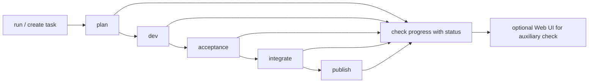

# shipyard-cp

[日本語版](./README.md) | English


`shipyard-cp` is a control plane for upstream orchestration of multiple AI providers/workers with bounded nesting.  
It uses LiteLLM as the inference gateway and controls Codex/Claude Code/Google Antigravity/GLM-5 workers on a unified task/run/gate/audit model.

The core of this product is backend/worker/CLI.  
The frontend is a supplementary UI for viewing tasks and runs, checking status, and auxiliary operations.

## Quick Start in 3 Minutes

Start the backend, submit a task via CLI, and check the status to grasp the overall picture.

```bash
pnpm install
pnpm run dev
curl http://localhost:3000/healthz
```

After that, use the following entry points from Claude Code/Codex:

1. Submit a task: [run command](./.claude/commands/run.md)
2. Check status: [status command](./.claude/commands/status.md)
3. Follow the full flow: [pipeline command](./.claude/commands/pipeline.md)

If lost, start from the master hub: [CLI Usage](./docs/cli-usage.md).  
To quickly see command roles, refer to [`.claude/commands` entry](./.claude/commands/README.md).

## CLI Flow Diagram



## Latest Release: v0.2.0

OpenCode serve/session reuse integration complete. See [Release Notes](https://github.com/RNA4219/shipyard-cp/releases/tag/v0.2.0).

Key features added:
- Session reuse with same-stage policy
- Agent-aware session profiles (planning/build/verification)
- Warm pool for idle session optimization
- Event stream tracking and orphan recovery

## What Problem Does This Solve?

When you start using AI coding agents in production, the following problems emerge quickly:

- Which task is at what stage right now?
- Boundaries between plan/dev/acceptance are vague; only results come back without progress tracking
- Codex, Claude Code, and other workers have different I/O patterns and habits, causing scattered operations
- In nested agent configurations, delegation depth and responsibility boundaries become ambiguous
- On failure, retry/hold/accept/publish decisions are handled ad-hoc by humans
- Even connected to GitHub/tracker, state and artifact mappings are scattered

`shipyard-cp` is a control plane designed to organize this "operational chaos when AI workers are put on production workflows."

Specifically, it handles:

- Multiple providers/workers from a single upstream orchestrator
- Bounded nesting (not infinite delegation) to control task depth and responsibility
- Explicit stages: `plan -> dev -> acceptance -> integrate -> publish`
- Absorb worker differences with common `WorkerJob`/`WorkerResult` contracts
- Centralize retry/lease/heartbeat/capability gates in the control plane
- Leave task/run/timeline/audit for post-hoc traceability
- Connect state/document/tracker references via `agent-taskstate-js`, `memx-resolver-js`, `tracker-bridge-js`

In short, not just "let AI write code" but a control plane to bundle multiple workers with bounded nesting and put them on production workflows.

## Operating Policy

- Primary path: CLI/Claude Code/Codex
- Auxiliary path: Web UI
- Internal contract: API/OpenAPI/schema

The everyday entry point is CLI-first, not direct API calls.  
API is maintained for UI connection, internal contracts, automation, and verification.

## First Entry Points

Start here:

1. [CLI Usage](./docs/cli-usage.md)
2. [run command](./.claude/commands/run.md)
3. [status command](./.claude/commands/status.md)
4. Optionally [pipeline command](./.claude/commands/pipeline.md)
5. Current implementation/operation status: [RUNBOOK](./docs/project/RUNBOOK.md)

## Quick Start

```bash
pnpm install
pnpm run dev
```

Connectivity check:

```bash
curl http://localhost:3000/healthz
```

For auxiliary UI:

- UI: `http://localhost:8080`
- API: `http://localhost:3000`

## CLI Usage

Daily operations follow [docs/cli-usage.md](./docs/cli-usage.md).

Common entry points:

- Submit single task: [run.md](./.claude/commands/run.md)
- Check status: [status.md](./.claude/commands/status.md)
- Follow full flow: [pipeline.md](./.claude/commands/pipeline.md)
- Understand command differences: [commands README](./.claude/commands/README.md)

Notes:

- `.claude/commands/` is not part of product runtime; it's an operational command collection for Claude Code
- Direct API calls should be limited to debugging/verification

## Operational Skills

Skills for Codex/Claude Code are in [skills](./skills):

- [shipyard-cp-cli-quickstart](./skills/shipyard-cp-cli-quickstart/SKILL.md)
- [shipyard-cp-cli-pipeline](./skills/shipyard-cp-cli-pipeline/SKILL.md)

Skills are operational guides for repo users, not product API contracts.

## Architecture Overview

```text
shipyard-cp
├─ src/                  backend / control plane core
├─ web/                  auxiliary UI
├─ packages/             bundled npm packages
│  ├─ agent-taskstate-js
│  ├─ memx-resolver-js
│  ├─ tracker-bridge-js
│  └─ shared-redis-utils
├─ infra/                Docker / compose / kubernetes / TLS
├─ docs/                 requirements / operation / specs / CLI hub
└─ skills/               Codex / Claude Code operational Skills
```

Main responsibilities:

- `src/`: state machine, dispatch, result orchestration, acceptance/integrate/publish, monitoring
- `src/domain/worker/`: WorkerAdapter contract, session reuse, event stream normalization, orphan recovery
- `src/infrastructure/`: server manager, session executor, fallback control
- `web/`: task/run viewing, auxiliary operations, connection check
- `packages/`: embedded dependencies for state/resolver/tracker
- `infra/`: compose, Dockerfile, Kubernetes TLS assets

### Worker Execution Architecture (Internal)

Codex/Claude Code workers use OpenCode serve/session reuse internally. See [OpenCode Specification](./docs/project/OPENCODE_SPECIFICATION.md).

Summary:
- **Session reuse**: reuse sessions under same conditions (same-stage only)
- **Warm pool**: pre-validate idle sessions
- **Event stream**: track transcript/tool_use/permission_request
- **Orphan recovery**: auto cleanup on timeout/crash

External API contracts maintained. Public worker types remain codex/claude_code/google_antigravity/glm_5.

## Web UI Position

Web UI is "auxiliary", not "main".

- Task/run viewing
- Status check
- Auxiliary dispatch/acceptance completion operations

CLI and worker flows are primary; frontend is a light path that doesn't interfere.  
See [web/README.md](./web/README.md) and [web/FRONTEND_RUNBOOK.md](./web/FRONTEND_RUNBOOK.md).

## Minimum Environment Variables

For local startup:

- `.env` or environment variables
- `REDIS_URL` (if using Redis)

Commonly needed for external integration:

- `OPENAI_API_KEY`
- `ANTHROPIC_API_KEY`
- `GOOGLE_API_KEY`
- `GITHUB_TOKEN`
- `GLM_API_KEY`

Add only required keys for live tests and publish operations.

## Infrastructure Assets

- compose: [infra/docker-compose.yml](./infra/docker-compose.yml)
- production compose: [infra/docker/docker-compose.yml](./infra/docker/docker-compose.yml)
- backend Dockerfile: [infra/docker/api.Dockerfile](./infra/docker/api.Dockerfile)
- k8s/TLS: [infra/kubernetes/tls](./infra/kubernetes/tls)

## Documentation

Key documents:

- [CLI Usage](./docs/cli-usage.md): CLI-first operation master hub
- [REQUIREMENTS](./docs/project/REQUIREMENTS.md): Requirements definition
- [RUNBOOK](./docs/project/RUNBOOK.md): Implementation/operation current status
- [OpenCode Specification](./docs/project/OPENCODE_SPECIFICATION.md): Worker internal implementation spec
- [State Machine](./docs/state-machine.md): State transition spec
- [API Contract](./docs/api-contract.md): API contract
- [OpenAPI](./docs/openapi.yaml): OpenAPI 3.1
- [Schemas](./docs/schemas): JSON Schema collection
- [BIRDSEYE](./docs/BIRDSEYE.md): Document navigation

## Testing and Quality

Common commands:

```bash
pnpm test           # run tests
pnpm run test:coverage  # tests with coverage
pnpm run build      # build
cd web && npm test  # frontend tests
cd web && npm run build  # frontend build
```

Test composition:

- Test files: 89 files
- Test cases: ~2,100
- Test code: ~55,000 lines
- Coverage: ~83% (src/)

Live tests require external API tokens.  
Tokens managed via `.env` or environment variables; never directly in repo.

## About API

API exists but is positioned as internal contract.

- UI connection
- Automation
- Worker/result reflection
- Debug/verification

For normal operations, prefer CLI path at [docs/cli-usage.md](./docs/cli-usage.md).