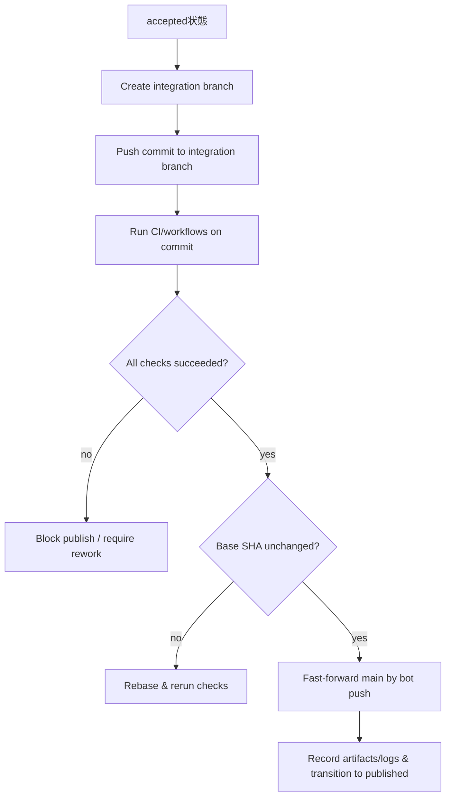

# AIワーカー統治 Control Plane 要件定義書

## エグゼクティブサマリー

本書は、AIワーカー（実行系）を束ねて **責任分離（Dev / Acceptance / Publish）** 付きで「計画→実装→自己テスト→検収→差し戻し→公開」を流すための **Control Plane** の要件定義である。特に、未確定だった論点（Publishの初期実装方針、PRなし運用、手動Acceptanceの扱い、コンテナのエフェメラル粒度、GitHub Projects v2の置き場所）を、あなたの回答に基づき「仕様として固定」する。

本書の最重要決定は次のとおり。

- Publish の初期挙動は、**OpenAI Codex / Anthropic Claude Code の"承認（approval）＋サンドボックス（sandbox）"モデルに準拠**し、デフォルトは「危険な副作用を自動実行しない」構成とする。Codex はデフォルトでワークスペース内での編集・実行を許しつつ、ワークスペース外の編集やネットワークを要するコマンド等では承認を求め、ツールが副作用を広告する場合も承認を引き起こし得る。さらに destructive と注釈されたツール呼び出しは常に承認が必要という設計が明示されている。
- 「レビューさせない」は **(b) PR自体も無し**を理想（デフォルト）とし、リポジトリ更新は原則 **直コミット（Direct-to-main）** で行う。ただし、GitHubの必須ステータスチェックは「保護ブランチへマージする前」に効くことが明確であるため、PRなしの場合に"GitHub側だけ"で完全担保するのは難しい。よって、**main への push をボットのみに制限**し、かつ Control Plane 側で「統合ブランチで検証→成功後に main を更新」という統治手順を必須化する。
- Acceptance は **手動検証を必須**としつつ、検証範囲は **リスク分類（risk-based testing）**で重み付けする。ISTQB でもリスクベースドテストは、テスト活動の選択・優先順位付けをリスクレベルに基づいて行うアプローチとして定義される。
- 実行基盤は隔離容易性により **コンテナ中心**とし、デフォルトは **Taskが完了/破棄されるまで同一コンテナ（または同一Taskワークスペース）を保持**する（最小コスト）。例外として高リスク時にのみ、最小コストの"リセット（破棄→再作成）"を選べる。Dockerはコンテナ分離の基盤として namespaces と cgroups を用いることを公式に説明している。
- Kanban（正系）は GitHub Projects v2 を前提に **API運用（GraphQL）**とし、認証は GitHub App / PAT を用いる。`GITHUB_TOKEN` はリポジトリスコープで Projects へアクセスできないため、Projects 操作には GitHub App（組織Project推奨）または PAT が必要になる。

---

## 背景と目的

### 背景

- AI実行系（Codex、Claude Code 等）は強いが、「責任分離」「状態遷移の固定」「監査可能な運用統制」を製品として一貫して担保するには、上位の統治層（Control Plane）が必要である。これは実装品質の問題というより、工程責任と再現性の問題である。
- Publish（外部副作用）が"まだ見えていない"状態は、むしろ設計上は「Publish＝副作用境界」として抽象化し、No-op/Dry-run/Apply を段階的に昇格できるようにする好機である（副作用の列挙から入ると設計が固まらない）。

### 目的

- コード生成・変更・検証・公開を、**工程責任の分離**つきで流し、**監査可能なログ**と **カンバン同期**で運用する。
- 下位ワーカー（Codex/Claude Code/AnimaWorks等）は交換可能にし、統治（契約・状態・権限・ログ・可視化）を自前で握る。

---

## 決定事項と設計方針

### Publish の初期実装方針

**決定**：Publish は Codex/Claude Code の「承認＋サンドボックス」思想に準拠し、危険な副作用をデフォルトで自動実行しない。

- Codex は、ワークスペース外の編集やネットワークを要するコマンドで承認を要求し得ること、さらに"副作用を広告する"アプリ/MCPツール呼び出しでも承認を誘発し得ること、destructive と注釈されたツール呼び出しは常に承認が必要であることを明示している。
- Codex `codex exec`（自動化）では、デフォルトが read-only sandbox であり、編集を許可するには `--full-auto` 等で明示的に権限を上げ、危険な full access は分離された環境（CI runner/コンテナ）でのみ使うべき、と説明されている。
- Claude Code では allow/ask/deny の権限ルールと、その評価順（deny→ask→allow、最初一致が優先、denyが常に優先）が仕様として提示される。
- Claude Code の `bypassPermissions` は「隔離された環境（コンテナ/VM）でのみ使用」すべきで、管理者が無効化できる旨が明記される。

**要求（要点）**：Publish は少なくとも次を満たす。
- モード上、Publish は accepted 以降のみ実行可能（責任分離の強制）。
- Publish 実行は「承認が必要な副作用カテゴリ」を明確に分類し、未承認カテゴリは自動実行しない。
- Publish の副作用は、必ずログ（監査）・外部参照（例：リリースID、タグ、デプロイ番号）として記録する。

### 「PR無し（レビュー無し）」運用の原則

**決定**：理想は PR 自体無し（b）。ただし安全担保は GitHub 側の PR 設計に依存しないよう Control Plane 側に持つ。

- GitHub の status checks は、必須化されている場合「保護ブランチへマージする前に通過する必要がある」と明記されるため、PR無し直pushの品質ゲートとしては不十分になり得る。
- 一方、保護ブランチは「重要ブランチを保護し、プッシュやマージ等の要件を課す」ための仕組みで、誰がpushできるかの制限等を持つ。

**要求（要点）**：
- main への push 権限は **ボット（GitHub App / bot user）のみに限定**できること。
- Control Plane は「統合ブランチ（例：`cp/integrate/<task_id>`）で検証を通す→同一コミットを main に fast-forward」という"PR無しゲート"を標準手順として提供する（詳細は後述）。

### Acceptance の手動必須とリスク分類

**決定**：手動検証は必須。ただしカバレッジはリスク分類で"リスクがあるものを網羅"する。

- リスクベースドテストは、リスクタイプ/リスクレベルに基づいてテスト活動とリソース配分を選択・優先するアプローチとして定義される。

**要求（要点）**：
- すべての Task に **手動Acceptanceステップ**を要求する（「やった」という操作ログが残る）。
- 高リスク（後述）では、仕様から導出した回帰テスト＋追加の手動チェックを必須とする。
- エビデンス（スクショ等）は必須ではないが、**ログ（何でもよい）は必須**とし、Artifact として保存する。

### コンテナの保持粒度（エフェメラル設計）

**決定**：コンテナ内に隔離されているなら、Taskが完了・破棄されるまで同一環境維持でよい。高リスク時に最小コストでリセット可能にする。

- Docker は `docker run` の裏側で namespaces と cgroups を作り、これが分離の基盤になると説明している。

**要求（要点）**：
- デフォルト：Task-scoped workspace（コンテナ/ボリューム）が維持され、複数Runで再利用できる。
- 例外：高リスクまたは汚染疑い時に「コンテナ破棄→再作成」できる（最小実装）。

### GitHub Projects v2 の置き場所

**決定**：API運用（GraphQL）を前提に設計する。
- Projects v2 の自動化は GraphQL API を用いると明記され、日本語ドキュメントでも token の scope（`read:project` / `project`）や GitHub App installation token を使えることが説明される。
- `GITHUB_TOKEN` はリポジトリスコープで Projects にアクセスできず、組織Projectでは GitHub App が推奨される旨が明記される。

**要求（要点）**：
- Projects v2（組織Projectを主）に対し、Control Plane が API で item 追加・フィールド更新を行えること。

---

## 機能要件

本節は、上記決定を実装に落とすための「必須機能（Must）」を定義する。

### Publish 要件

#### Publish の実行モード

Publish は **No-op / Dry-run / Apply** をサポートするが、デフォルト挙動は「Codex/Claude Code に準拠した安全側」に固定する。

- **Default（推奨）**：Dry-run（副作用の計画生成＋実行可能性チェック＋ログ化）。
  - 根拠：Codex はデフォルトでネットワーク無効（workspace-write sandbox でも network_access は明示的 opt-in）であり、ネットワークや危険操作の許可はリスク上昇である。
- **Apply**：明示設定と承認が揃った場合のみ実行（後述の approval gate）。
- **No-op**：Publish の座組みだけ回したい場合（運用試験、初期導入）に用意。

#### 「副作用」の定義と検出

副作用は最低限、次のカテゴリを含む。
- ネットワークアクセスを伴う操作（外部API/外部レジストリ）
- ワークスペース外の編集、または protected path への書き込み
- ツールが side-effect / destructive を広告する呼び出し（MCP/アプリ等）

Codex は、ワークスペース外編集やネットワークを要するコマンドで承認を要求すること、また"副作用を広告するツール呼び出し"でも承認を引き起こし得ること、destructive 注釈は常に承認対象であることを明記する。

#### Publish approval gate（承認ゲート）

- Control Plane は Publish Run 作成時に、少なくとも次を要求する。
  - `apply_enabled`（プロジェクト設定）
  - `approval`（operator の明示承認、またはポリシーで自動承認）
  - `idempotency_key`（同一Publishの二重実行を防ぐキー）
- 実行系連携の推奨：GitHub Actions Environments の deployment protection rules（手動承認、遅延、ブランチ制限等）を利用し、Secrets は保護ルールを満たしてから解放する。

### PR無し（直コミット）Repo 更新要件

#### RepoPolicy（設定要件）

Control Plane はプロジェクト単位で RepoPolicy を持つ。

- `update_strategy`: `direct`（デフォルト） / `pr`（オプション）
- `main_push_actor`: GitHub App / bot user（必須）
- `integration_branch_prefix`: `cp/integrate/`（推奨）

保護ブランチは push 制限などを設定でき、特定のユーザー/チーム/アプリのみ push を許可できる。

#### Direct-to-main 実行手順（標準フロー）

GitHub の required status checks は「マージ前ゲート」であることが明記されているため、PR無し運用では Control Plane 側で以下を**必須手順**とする。

**要求（Must）**：
- integration branch で CI を走らせ、**同一コミットSHA**に対する checks の成功を確認してから main を更新する。
- main 更新は bot のみ（人間は不可）。
- main 更新前に base SHA の不変性を確認し、変化していたら rebase→再検証する（簡易 merge-queue 相当）。

### Acceptance 要件（手動必須＋リスク分類）

#### リスク分類（Risk Model）

Control Plane は Plan モード（または Acceptance 開始前）に、最低限のリスク判定を持つ。判定は自動（独立ワーカー）＋人間上書きを許可する。

- Risk level: `low` / `medium` / `high`
- 判定材料（例）：
  - 変更範囲（差分量、変更ファイル種別）
  - コア領域（認証、権限、データ永続）への影響
  - 外部副作用（ネットワーク、Secrets、公開API）
  - データ変更（migration）
  - ロールバック容易性

リスクベースドテストは、リスクに基づいてテスト活動とリソース配分を選択・優先するアプローチとして定義される。

#### 手動検証の最小要件

- 全Taskで必須：
  - 手動検証チェックリストの実施（短くて良い）
  - **ログArtifactを最低1つ**登録（形式自由。stdoutでも、テストランログでもよい）

#### 高リスク時の必須要件

- regression suite の実行（仕様由来のテストケース群）
- 追加の手動チェック（対象機能の主要1動線、危険操作の抑止確認）
- Publish へ引き渡す「ロールバック観点メモ」（短文でよい）

### コンテナ実行基盤要件（Taskスコープ保持）

#### デフォルト：Task-scoped workspace

- Task にひもづく workspace（コンテナ or ボリューム）を作成し、Run 間で再利用する。
- Task が closed/cancelled になった時点で破棄する（またはアーカイブする）。

Docker は namespaces と cgroups によってコンテナ分離を成立させると説明する。

#### 例外：最小コスト・リセット

- 高リスクまたは汚染疑いでのみ、workspace を破棄→再作成できる。
- user namespace の利用など、隔離強化オプションを持てる（将来）。

---

## 外部連携要件

### GitHub Projects v2（API運用）要件

- Control Plane は Projects v2 を GraphQL で操作する（item追加、フィールド更新）。GraphQL API により Projects を自動化できることが日本語ドキュメントで明記される。
- 認証は以下を要件とする。
  - 組織Projectが主の場合：GitHub App（推奨）
  - ユーザーProjectの場合：PAT（推奨）

GitHub Docs は `GITHUB_TOKEN` がリポジトリレベルスコープで Projects にアクセスできないこと、Projects へアクセスするには GitHub App（組織Project推奨）または PAT（ユーザーProject推奨）が必要であることを明記する。

- 組織Projectを自動化する GitHub App は、組織Projectの read/write 権限が必要で、repository projects の権限だけでは不十分である旨が記載される。
- token scope として `read:project`（参照）または `project`（更新）が必要である旨が日本語ドキュメントに記載される。

### GitHub Environments（Publish統制）要件

- Publish の Apply 実行時、GitHub Actions Environments を利用できる場合は、deployment protection rules による承認・遅延・ブランチ制限を利用する。GitHub Docs は手動承認やブランチ制限を含む protection rules を説明している。
- Secrets は protection rules を満たすまで実行ジョブへ渡されない（= Publish で secrets を扱う時の自然な境界になる）。

---

## 非機能要件とセキュリティ要件

### 実行権限モデル（Codex/Claude Code準拠）

#### Codex 側（実行系）に合わせるべき前提

- Codex はデフォルトでネットワーク無効、ワークスペース内の権限に限定したサンドボックスを前提とし、sandbox/approval を設定で調整できる。
- `codex exec` は自動化用途で、デフォルト read-only sandbox、編集には `--full-auto` が必要であり、危険な full access は隔離環境でのみ推奨される。

#### Claude Code 側（実行系）に合わせるべき前提

- allow/ask/deny の権限ルールを採用し、deny が常に優先される（評価順が仕様化されている）。
- `plan` モードは「分析のみでファイル変更やコマンド実行をしない」性格として定義されている。
- `bypassPermissions` は隔離環境でのみ使用すべきで、管理者が無効化できる（Control Plane の安全方針と一致させやすい）。

### 実行環境の隔離と選択肢

- 推奨はコンテナ中心。Docker はコンテナ分離の基盤（namespaces/cgroups）を説明する。
- 追加の隔離強化（選択肢）：user namespace remap 等を適用できる。

もし GitHub-hosted runners を補助的に使う場合、GitHub Docs は hosted runners が「エフェメラルでクリーンな隔離VM」で実行され、永続的侵害が難しいことを明記する（対照的に self-hosted は永続侵害され得る）。
本要件では「コンテナ保持（Taskスコープ）」がデフォルトだが、Publish のような高リスク実行で hosted runner を使う選択肢を残すのは合理的である。

### 監査ログ要件（最低限）

- Publish / main更新 / verdict 提出 / 権限昇格（sandbox/approval変更）は必ずイベントとして記録する。
- Acceptance は「ログArtifactが最低1つ必須」。
- 外部参照（リリースID、デプロイ番号、タグ等）がある場合は必ず保存する（冪等性と追跡のため）。

---

## 受け入れ条件と未決事項

### 本要件の受け入れ条件（Definition of Done：要件レベル）

- Publish は Dry-run がデフォルトで成立し、Apply は明示設定＋承認が無い限り実行されない（Codex/Claude Code の approval/sandbox 思想に整合）。
- PR無し運用（direct）がデフォルトで、main 更新はボットのみ、かつ "integration branch で checks 成功→main更新" が必須フローとして動く（status checks がマージ前ゲートである点を踏まえた統治）。
- Acceptance は手動必須で、低リスクでも「手動ステップ＋ログArtifact」が最低限残り、高リスクでは回帰＋追加チェックが必須になる（risk-based testing の定義に整合）。
- Projects v2 は API（GraphQL）で更新され、`GITHUB_TOKEN` ではアクセスできないことを前提に、GitHub App/PAT で運用できる。

### 逆質問（実装に入る前に、短く確定したい点）

- 「PR無し」運用で、main 更新を **どのタイミングで"Publish"に含めるか**：
  - 案A：main 更新＝Publish（外部副作用）として Publish モードに集約
  - 案B：main 更新＝Dev/Acceptance の結果反映として "Integrate" という中間工程を追加（Publishはデプロイ等に限定）
  どちらを採るかで state machine と権限境界が変わる。
- 高リスクの定義で「絶対に high 扱いにする条件」を先に固定するか：
  例：Secrets触れる、ネットワーク許可が要る、データ永続/認証まわり、など。
- コンテナ保持（Taskスコープ）で、キャッシュ（依存DL等）をどこまで共有するか：
  完全共有は速度が出るが汚染リスクが上がる。最小実装では"共有しない"でもよいが、どちらを優先するか。