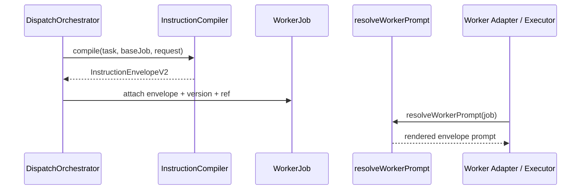
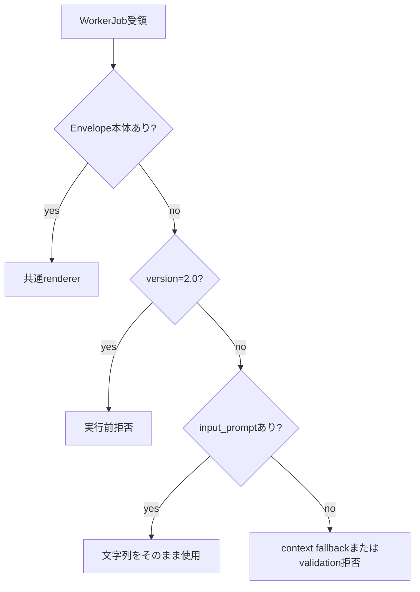

# Worker指示精度 設計書

## 構成

| コンポーネント | 責務 |
| --- | --- |
| `InstructionCompiler` | Task、policy、stageから`InstructionEnvelopeV2`を生成する |
| `DispatchOrchestrator` | Envelope本体、version、refを同一`WorkerJob`へ束ねる |
| `resolveWorkerPrompt` | Envelope優先、欠落拒否、legacy互換の分岐を一元化する |
| `renderInstructionEnvelope` | Envelopeを順序固定のworker promptへ変換する |
| worker adapters / executors | 共通resolverの結果をworkerへ渡し、独自解釈を持たない |

## データ

### WorkerJob例

```json
{
  "job_id": "job_001",
  "task_id": "task_001",
  "stage": "dev",
  "input_prompt": "DEV task: Improve instructions\n\nObjective: Deliver precise worker instructions",
  "metadata": {
    "instruction_envelope_version": "2.0"
  },
  "context": {
    "instruction_envelope_ref": "envelope:job_001:dev"
  },
  "instruction_envelope": {
    "protocol_version": "2.0",
    "job_id": "job_001",
    "task_id": "task_001",
    "typed_ref": "agent-taskstate:task:local:task_001",
    "stage": "dev",
    "authority": [],
    "objective": "Deliver precise worker instructions",
    "must": [],
    "must_not": [],
    "allowed_tools": [],
    "required_output": {
      "kind": "tool_plan",
      "json_schema": { "type": "object" }
    }
  }
}
```

## 成功フロー



## 失敗フロー



## 設計判断

### Envelope本体をWorkerJobへ載せる理由

refだけではresolver実装や永続化状態に依存し、worker実行時に指示が欠落しうる。
job単体を自己完結させることで、adapter差、session再利用、artifact再現時の意味差を抑える。

### 共通rendererをdomain instruction層へ置く理由

adapterごとにprompt組立てを持つと、authorityやallowed toolsの一部欠落が再発する。
生成契約とレンダリング契約を同じdomain配下へ集約し、executorは伝達だけを担う。

### legacy promptを完全保持する理由

既存consumerは自由文の完全一致やprovider固有promptを前提にする可能性がある。
Envelope未使用jobの文字列を整形し直さず、破壊的な意味変更を避ける。

## 影響とリスク

- WorkerJob payloadがEnvelope分だけ増加する。現状のEnvelope規模では許容し、将来大規模化した場合のみ永続ref方式を再検討する。
- versionだけを付与していた既存fixtureや外部producerは拒否されるため、Envelope本体を同時に渡す必要がある。
- renderer出力を変更すると全worker経路へ影響するため、共通rendererのgolden/contract testを必須とする。

## テスト設計

- `instruction-renderer.test.ts`: セクション完全性、欠落拒否、legacy完全保持
- `dispatch-orchestrator.test.ts`: Envelope本体、ref、objective fallback
- adapter / executor tests: 共通resolver利用と既存互換
- `glm5-adapter.test.ts`: Envelope modeとallowed toolsの本体参照

