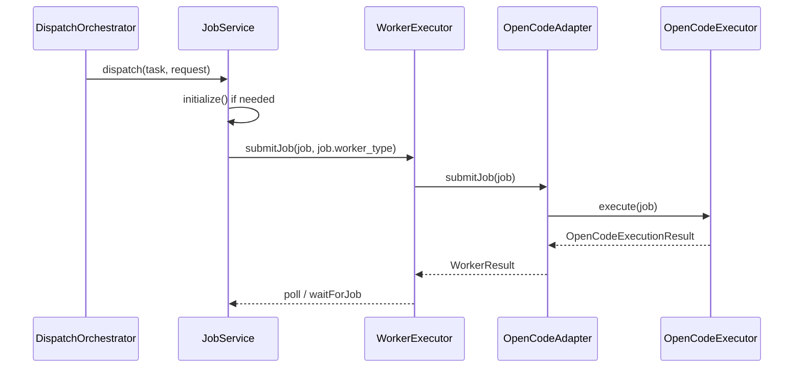

# OpenCode 統合仕様書

## 文書の位置づけ

本書は、`shipyard-cp` に `opencode` を coding agent substrate として統合するための仕様書である。

役割分担は次のとおり。

- 要件: [REQUIREMENTS.md](./REQUIREMENTS.md)
- 設計意図と拡張方針: [OPENCODE_INTEGRATION_MEMO.md](./OPENCODE_INTEGRATION_MEMO.md)
- 実装指示: [OPENCODE_IMPLEMENTATION_INSTRUCTIONS.md](./OPENCODE_IMPLEMENTATION_INSTRUCTIONS.md)
- 本書: 実装対象の具体仕様

要件と本書が衝突する場合は、要件を優先する。

## 変更管理

- 対象プロダクト: `shipyard-cp`
- 対象スコープ: `codex` / `claude_code` logical worker の backend 切替
- 対象外: `google_antigravity` の実行 substrate 変更
- 互換性方針: API 上の `WorkerType` は増やさず、backend は内部実装として切り替える

## 目的

`shipyard-cp` の orchestration / policy / audit / state machine を維持しながら、Plan / Dev / Acceptance の実行 substrate を `opencode` ベースで扱えるようにする。

本仕様の狙いは次の 4 点である。

1. logical worker と execution backend を分離する
2. `opencode` を `codex` / `claude_code` の backend として扱えるようにする
3. LiteLLM の責務を model gateway に限定する
4. 既存の state machine / audit / WorkerType 契約を壊さずに導入できるようにする

## 成功条件

本仕様の導入が完了したとみなす条件は次のとおり。

1. `JobService` が `codex` / `claude_code` を backend 設定に応じて初期化できる
2. dispatch で決定した `job.worker_type` が submit 時にもそのまま使われる
3. `opencode` backend 実行時に、workspace 内へ `prompt.md`、`opencode.json`、`stdout.log`、`stderr.log` が生成される
4. `WorkerResult.metadata.substrate` に `opencode` が記録される
5. `CLAUDE_WORKER_BACKEND=glm` へ戻した場合に、既存 GLM 経路へ後方互換で切り替わる
6. 型チェックとテストが通る

## 非目的

本仕様では、次は扱わない。

- `WorkerType` へ `opencode` を追加すること
- `shipyard-cp` の state machine を `opencode` 側へ移譲すること
- `opencode serve` による永続セッション統合の完成
- workspace materialization の完全実装
- OpenCode event stream の完全な意味解析

## 用語

### logical worker

`shipyard-cp` の公開契約上の worker 種別。現時点では次の 3 種を指す。

- `codex`
- `claude_code`
- `google_antigravity`

### backend

logical worker の裏で実際にジョブを実行する実装。

例:

- `opencode`
- `glm`
- `claude_cli`
- `simulation`

### substrate

backend のうち、ファイル探索、編集、bash、permission、artifact 収集など、coding agent としての実行面を提供する基盤。

本仕様では `opencode` を第一級 substrate とする。

### execution backend

logical worker の実行要求を最終的に処理する具体実装を指す。`OpenCodeAdapter`、`GLM5Adapter`、`ProductionClaudeCodeAdapter` などが該当する。

## 全体アーキテクチャ

```text
DispatchOrchestrator
  -> WorkerJob(worker_type = codex | claude_code | google_antigravity)
  -> JobService
       -> backend selection from Config.worker
       -> WorkerExecutor.registerAdapter(...)
            codex -> OpenCodeAdapter | CodexAdapter
            claude_code -> OpenCodeAdapter | GLM5Adapter | ProductionClaudeCodeAdapter | ClaudeCodeAdapter
            google_antigravity -> AntigravityAdapter
  -> WorkerExecutor.submitJob(job, job.worker_type)
  -> adapter / executor
  -> WorkerResult normalized back into shipyard-cp
```

## 実行シーケンス

### 1. dispatch から submit まで



### 2. workspace 解決

```text
if job.workspace_ref.kind === 'host_path' and workspace_id is absolute path
  use workspace_id directly
else
  use <WORKER_WORK_DIR>/<job_id>
```

### 3. stage ごとの責務

| stage | 主目的 | edit | bash | webfetch |
| --- | --- | --- | --- | --- |
| `plan` | 計画・調査・整理 | deny | deny | deny |
| `dev` | 実装・テスト | allow | allow | 条件付き |
| `acceptance` | 検証・判定 | deny | allow | 条件付き |

## 設定仕様

### Config.worker

`src/config/index.ts` の `WorkerConfig` に次を持つ。

- `claudeBackend: 'opencode' | 'glm' | 'claude_cli' | 'simulation'`
- `codexBackend: 'opencode' | 'simulation'`
- `opencodeCliPath: string`
- 既存の `claudeModel`, `codexModel`, `glmModel`, `claudeCliPath`, `workDir`, `jobTimeout`, `debugMode`

### 環境変数

- `CLAUDE_WORKER_BACKEND`
- `CODEX_WORKER_BACKEND`
- `OPENCODE_CLI_PATH`

補足:

- `CLAUDE_WORKER_BACKEND` は `opencode | glm | claude_cli | simulation`
- `CODEX_WORKER_BACKEND` は `opencode | simulation`
- `OPENCODE_CLI_PATH` は `PATH` 上のコマンド名または絶対パス

デフォルト値:

- `CLAUDE_WORKER_BACKEND=opencode`
- `CODEX_WORKER_BACKEND=opencode`
- `OPENCODE_CLI_PATH=opencode`

### backend 選択マトリクス

| logical worker | backend 設定値 | 実アダプタ |
| --- | --- | --- |
| `codex` | `opencode` | `OpenCodeAdapter(workerType='codex')` |
| `codex` | `simulation` | `CodexAdapter(workerType='codex')` |
| `claude_code` | `opencode` | `OpenCodeAdapter(workerType='claude_code')` |
| `claude_code` | `glm` | `GLM5Adapter(workerType='claude_code')` |
| `claude_code` | `claude_cli` | `ProductionClaudeCodeAdapter(workerType='claude_code')` |
| `claude_code` | `simulation` | `ClaudeCodeAdapter(workerType='claude_code')` |

### 推奨設定例

#### ローカル開発

```dotenv
CLAUDE_WORKER_BACKEND=opencode
CODEX_WORKER_BACKEND=opencode
OPENCODE_CLI_PATH=opencode
WORKER_WORK_DIR=/tmp/shipyard-jobs
WORKER_JOB_TIMEOUT=600000
```

#### 既存 GLM 後方互換

```dotenv
CLAUDE_WORKER_BACKEND=glm
CODEX_WORKER_BACKEND=simulation
```

## JobService 初期化仕様

### 初期化方針

`JobService.initialize()` は 1 回だけ worker adapter を登録する。

logical worker ごとの backend 選択ルールは次のとおり。

#### codex

- `codexBackend === 'opencode'` の場合、`OpenCodeAdapter(workerType='codex')`
- それ以外は `CodexAdapter(workerType='codex')`

#### claude_code

- `claudeBackend === 'opencode'` の場合、`OpenCodeAdapter(workerType='claude_code')`
- `claudeBackend === 'glm'` の場合、`GLM5Adapter(workerType='claude_code')`
- `claudeBackend === 'claude_cli'` の場合、`ProductionClaudeCodeAdapter(workerType='claude_code')`
- `claudeBackend === 'simulation'` の場合、`ClaudeCodeAdapter(workerType='claude_code')`

#### google_antigravity

- 常に `AntigravityAdapter(workerType='google_antigravity')`

### submit 仕様

`JobService.dispatch()` は `WorkerExecutor.submitJob(job, job.worker_type)` を呼ばなければならない。

禁止事項:

- `submitJob(job, 'claude_code')` のような hardcode
- dispatch で決まった worker selection を submit 時に上書きすること

### 実装上の必須不変条件

1. `dispatchResult.job.worker_type` と `submitJob` の第 2 引数は一致する
2. `initialize()` は多重登録を避けるため一度だけ実行する
3. `codex` と `claude_code` は同時に登録可能である
4. backend 切替は process 起動時設定に従い、ジョブ途中で動的変更しない

## OpenCodeExecutor 仕様

### 責務

`OpenCodeExecutor` は次を担う。

- 実行 workspace の決定
- prompt ファイルの生成
- 一時 `opencode.json` の生成
- `opencode run` の subprocess 実行
- stdout / stderr の収集
- artifact 生成
- timeout / cancel

### 実行ディレクトリ

`resolveWorkPath(job)` は次のルールで決定する。

1. `job.workspace_ref.kind === 'host_path'` かつ `workspace_id` が絶対パスなら、そのパスを使う
2. それ以外は `WORKER_WORK_DIR/<job_id>` を使う

### 実行コマンド

最小仕様では次の形で CLI を呼び出す。

```text
opencode run "<prompt>"
```

`cwd` は解決済み workspace とする。

補足:

- 現行実装では prompt 内容は `prompt.md` にも保存される
- モデル指定は環境変数 `OPENCODE_MODEL` で CLI 側へ渡す
- 実行前に `opencode.json` を workspace 直下へ生成する

### 生成ファイル

workspace には最低限次を生成する。

- `prompt.md`
- `opencode.json`
- `stdout.log`
- `stderr.log`

### artifact 回収ルール

| ファイル | kind | 必須 | 用途 |
| --- | --- | --- | --- |
| `stdout.log` | `log` | 必須 | 実行出力、判定材料 |
| `stderr.log` | `log` | 必須 | エラー出力、失敗調査 |
| `prompt.md` | `report` | 必須 | 入力再現 |
| `opencode.json` | `json` | 必須 | permission 再現 |

### artifact 仕様

最低限、次を artifact として回収可能であること。

- `stdout.log`
- `stderr.log`
- `prompt.md`
- `opencode.json`

artifact URI は絶対パスで保持してよい。

## OpenCode permission 仕様

OpenCode には一時 `opencode.json` を生成して permission を渡す。

### plan

```json
{
  "permission": {
    "edit": "deny",
    "bash": "deny",
    "webfetch": "deny"
  }
}
```

期待挙動:

- 調査・要約・実装計画のみ許可する
- repo 編集、bash 実行、ネットワーク取得は不可

### dev

```json
{
  "permission": {
    "edit": "allow",
    "bash": "allow",
    "webfetch": "allow or deny"
  }
}
```

`webfetch` は `job.approval_policy.allowed_side_effect_categories` に `network_access` が含まれる場合のみ `allow`、それ以外は `deny`。

期待挙動:

- repo 編集とローカルテストを許可する
- ネットワークは approval policy に明示がある場合だけ許可する

### acceptance

```json
{
  "permission": {
    "edit": "deny",
    "bash": "allow",
    "webfetch": "allow or deny"
  }
}
```

`webfetch` の条件は dev と同様。

期待挙動:

- 検証・テスト・判定は許可する
- 追加編集は不可とする

## OpenCodeAdapter 仕様

### logical worker の取り扱い

`OpenCodeAdapter` は `workerType: 'codex' | 'claude_code'` を受け取る。

重要:

- `opencode` 自体は public な worker type ではない
- `OpenCodeAdapter.workerType` は logical worker の値を返す

### capabilities

#### workerType = `codex`

- `plan`
- `edit_repo`
- `run_tests`
- `produces_patch`
- `produces_verdict`

#### workerType = `claude_code`

- `plan`
- `edit_repo`
- `run_tests`
- `needs_approval`
- `produces_patch`
- `produces_verdict`
- `networked`

### submitJob

`submitJob(job)` の動作は次のとおり。

1. `validateJob(job)` を行う
2. `external_job_id = opencode-${workerType}-${job.job_id}-${timestamp}` を生成する
3. テスト環境 (`VITEST=true`) では mock result を返す
4. それ以外では `OpenCodeExecutor.execute(job)` を非同期実行する

### 外部ジョブ ID

生成規則:

```text
opencode-<worker_type>-<job_id>-<timestamp>
```

この ID は adapter 内部管理用であり、公開 API の永続 ID ではない。

### pollJob

状態は次の 4 種で管理する。

- `queued`
- `running`
- `succeeded`
- `failed`

`running` 中は推定進捗を返してよい。`succeeded` / `failed` になったら job state を削除する。

### cancelJob

キャンセル成功時は adapter 内部 state を削除し、以後の poll は `not found` 相当となってよい。

### cancelJob

`OpenCodeExecutor.cancel(job.job_id)` を呼び、成功時は `status: cancelled` を返す。

### collectArtifacts

`WorkerResult.artifacts` に格納済みの artifact を返せばよい。将来は executor 直接参照に拡張してよい。

## WorkerResult 正規化仕様

### 共通

`OpenCodeAdapter` は `OpenCodeExecutionResult` を `WorkerResult` に変換する。

必須項目:

- `summary`
- `artifacts`
- `usage.runtime_ms`
- `metadata.substrate = "opencode"`
- `metadata.logical_worker = workerType`

### 正規化マッピング

| OpenCodeExecutionResult | WorkerResult |
| --- | --- |
| `duration_ms` | `usage.runtime_ms` |
| `exit_code` | `usage.exit_code` |
| `artifacts` | `artifacts` |
| `output` | `summary` / `patch_ref` / `verdict` の判定材料 |

### patch 抽出

stdout に unified diff の兆候がある場合:

- `--- `
- `+++ `

が含まれれば `patch_ref` を設定する。

補足:

- 現行実装では unified diff 本文そのものを `patch_ref.content` に格納する
- `patch_ref.base_sha` には `job.repo_ref.base_sha` を使う

### acceptance verdict 抽出

順序は次のとおり。

1. stdout 全体を JSON として parse し、`outcome` があれば採用
2. 失敗したらテキスト heuristic を使う
3. `reject` または `rework` を含む場合は `rework`
4. それ以外は `accept`

### 失敗系の扱い

次の場合は `WorkerResult` を返さず、adapter poll 結果を `failed` とする。

| 条件 | 扱い |
| --- | --- |
| CLI 起動失敗 | `failed` |
| タイムアウト | `failed` |
| exit code 非 0 | `failed` |
| adapter 内例外 | `failed` |

### タイムアウト

- デフォルトは `WORKER_JOB_TIMEOUT`
- タイムアウト時は subprocess を kill し、`Job timed out after <ms>` を error とする

## WorkerJob 入力前提

本仕様で `OpenCodeAdapter` が前提とする `WorkerJob` の主要フィールドは次のとおり。

| フィールド | 必須 | 用途 |
| --- | --- | --- |
| `job_id` | 必須 | workspace / artifact 識別子 |
| `task_id` | 必須 | prompt と監査の相関 |
| `stage` | 必須 | permission 決定 |
| `worker_type` | 必須 | logical worker の明示 |
| `input_prompt` | 必須 | `opencode run` へ渡す本文 |
| `workspace_ref` | 必須 | 実行場所解決 |
| `repo_ref.base_sha` | 任意だが推奨 | patch 正規化 |
| `approval_policy.allowed_side_effect_categories` | 任意 | webfetch 許可判定 |

## 実行例

### 例1: claude_code を opencode backend で dev 実行

前提:

```dotenv
CLAUDE_WORKER_BACKEND=opencode
```

期待:

1. `JobService.initialize()` で `OpenCodeAdapter(workerType='claude_code')` が登録される
2. dispatch 結果の `job.worker_type` は `claude_code`
3. submit 時も `claude_code` が使われる
4. `WorkerResult.metadata.substrate === 'opencode'`

### 例2: claude_code を glm backend へ戻す

前提:

```dotenv
CLAUDE_WORKER_BACKEND=glm
```

期待:

1. `GLM5Adapter(workerType='claude_code')` が登録される
2. OpenCode CLI は使われない
3. 既存 completion ベース経路が維持される

## 受け入れテスト観点

### 初期化

1. `codexBackend=opencode` で `codex` が `OpenCodeAdapter` になる
2. `claudeBackend=opencode` で `claude_code` が `OpenCodeAdapter` になる
3. `claudeBackend=glm` で `claude_code` が `GLM5Adapter` になる

### dispatch / submit 整合

1. `dispatchResult.job.worker_type` が `submitJob` にそのまま渡る
2. hardcode された `'claude_code'` 経路が存在しない

### artifact

1. 実行後に 4 ファイルが生成される
2. `WorkerResult.artifacts` にそれらが正規化される

### permission

1. `plan` では `edit/bash/webfetch` がすべて `deny`
2. `dev` では `edit/bash` が `allow`
3. `acceptance` では `edit=deny`, `bash=allow`

### 後方互換

1. `glm` backend へ戻しても型チェックとテストが通る

## 将来拡張ポイント

- `opencode serve` を使った session 再利用
- より高精度な escalation 解析
- `stdout` の構造化出力契約
- workspace materialization の強化

### raw_outputs

artifact のうち `log` / `json` は `raw_outputs` に紐付ける。

## テスト仕様

### 型チェック

`npm run check` が通ること。

### 単体・結合テスト

`npm test` が通ること。

テスト観点:

- `JobService.initialize()` が backend 選択式である
- `submitJob(job, job.worker_type)` が使われる
- `OpenCodeAdapter` が `codex` / `claude_code` で初期化できる
- テスト環境で OpenCode CLI がなくても落ちない

## 後方互換仕様

### CLAUDE_WORKER_BACKEND=glm

`claude_code` logical worker は `GLM5Adapter` を使う。

このとき:

- 従来の LiteLLM 経由 completion 実行に戻る
- `WorkerType` は変わらない
- 既存テストは維持される

### CLAUDE_WORKER_BACKEND=claude_cli

`claude_code` logical worker は `ProductionClaudeCodeAdapter` を使う。

### CODEX_WORKER_BACKEND=simulation

`codex` logical worker は既存 `CodexAdapter` を使う。

## 制約

- `opencode` を導入しても state machine を変えてはならない
- `WorkerType` を増やしてはならない
- LiteLLM gateway を削除してはならない
- `plan` で edit を許可してはならない
- `acceptance` で edit を許可してはならない

## 将来拡張

### 1. serve/session 統合

- `opencode serve`
- `job_id <-> session_id` 対応
- transcript stream の監査反映

### 2. built-in agent マッピング

- `plan` stage -> built-in plan agent
- `dev` stage -> built-in build agent
- `acceptance` stage -> review / custom read-only agent

### 3. workspace materialization

- checkout 済み host path を `workspace_ref` に保持
- 実 repo 上で OpenCode を動かす

### 4. escalation 正規化強化

- tool use
- permission prompts
- command-level approvals
- event stream からの詳細抽出
