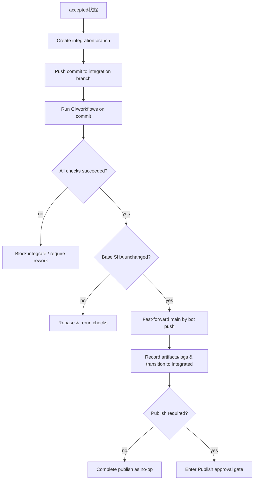

# AIワーカー統治 Control Plane 要件定義書

## エグゼクティブサマリー

本書は、AIワーカー（実行系）を束ねて **責任分離（Plan / Dev / Acceptance / Integrate / Publish）** 付きで「計画→実装→自己テスト→検収→統合→公開」を流すための **Control Plane** の要件定義である。特に、未確定だった論点（LiteLLM を基盤にしたワーカー接続方式、`agent-taskstate` / `tracker-bridge-materials` / `memx-resolver` の OSS 採用境界、Publish の初期実装方針、PR なし運用、手動 Acceptance の扱い、コンテナのエフェメラル粒度、GitHub Projects v2 の置き場所）を、仕様として固定する。

本書の最重要決定は次のとおり。

- Publish の初期挙動は、**OpenAI Codex / Anthropic Claude Code の"承認（approval）＋サンドボックス（sandbox）"モデルに準拠**し、デフォルトは「危険な副作用を自動実行しない」構成とする。Codex はデフォルトでワークスペース内での編集・実行を許しつつ、ワークスペース外の編集やネットワークを要するコマンド等では承認を求め、ツールが副作用を広告する場合も承認を引き起こし得る。さらに destructive と注釈されたツール呼び出しは常に承認が必要という設計が明示されている。
- **LiteLLM を基盤のモデルゲートウェイ兼ルータ**として採用し、Control Plane は LiteLLM 経由の推論呼び出しを標準経路とする。一方で、Claude Code / Codex / Google Antigravity は「交換可能なワーカー」として扱い、各ワーカー固有の権限モデル・実行形態・成果物をアダプタ層で吸収する。
- **`opencode` を coding agent 実行基盤の第一級候補**として採用し、CLI / server / agent 機能を worker substrate として扱う。`shipyard-cp` は orchestration / policy / audit / state を保持し、`opencode` は Plan / Dev / Acceptance 実行、セッション管理、ツール使用、成果物生成の実行面を担う。
- **`agent-taskstate` を内部 task state の正本**として採用し、shipyard-cp は独自 state machine を持ちながらも、Task / state transition / context bundle / typed_ref の canonical contract は `agent-taskstate` と整合させる。
- **`tracker-bridge-materials` を tracker 連携補助層**として採用し、外部 tracker 情報は helper layer として扱う。外部 tracker を内部 state の正本にしない。
- **`memx-resolver` を docs / memory resolver 基盤**として採用し、読むべき文書の解決、必要 chunk の取得、読了記録、stale 判定、契約解決は memx-resolver の責務として委譲する。
- 「レビューさせない」は **(b) PR 自体も無し**を理想（デフォルト）とし、リポジトリ更新は原則 **直コミット（Direct-to-main）** で行う。ただし、GitHub の必須ステータスチェックは「保護ブランチへマージする前」に効くことが明確であるため、PR なしの場合に GitHub 側だけで完全担保するのは難しい。よって、**main への push をボットのみに制限**し、かつ Control Plane 側で「統合ブランチで検証→成功後に main を更新」という統治手順を必須化する。
- Acceptance は **手動検証を必須**としつつ、検証範囲は **リスク分類（risk-based testing）**で重み付けする。ISTQB でもリスクベースドテストは、テスト活動の選択・優先順位付けをリスクレベルに基づいて行うアプローチとして定義される。
- 実行基盤は隔離容易性により **コンテナ中心**とし、デフォルトは **Task が完了/破棄されるまで同一コンテナ（または同一 Task ワークスペース）を保持**する（最小コスト）。例外として高リスク時にのみ、最小コストの"リセット（破棄→再作成）"を選べる。Docker はコンテナ分離の基盤として namespaces と cgroups を用いることを公式に説明している。
- Kanban（正系）は GitHub Projects v2 を前提に **API 運用（GraphQL）**とし、認証は GitHub App / PAT を用いる。`GITHUB_TOKEN` はリポジトリスコープで Projects へアクセスできないため、Projects 操作には GitHub App（組織 Project 推奨）または PAT が必要になる。
- `main` 更新は **Publish ではなく Integrate** として扱い、デプロイやリリース、外部 API 更新などの環境外副作用のみを Publish に含める。

---

## 背景と目的

### 背景

- AI 実行系（Codex、Claude Code、Google Antigravity 等）は強いが、「責任分離」「状態遷移の固定」「監査可能な運用統制」を製品として一貫して担保するには、上位の統治層（Control Plane）が必要である。これは実装品質の問題というより、工程責任と再現性の問題である。
- LiteLLM はモデル呼び出しの共通化、プロバイダ切替、ルーティング、利用量集計には有効だが、CLI ワーカーのジョブ制御・権限昇格・成果物回収までを単独では担わない。したがって Control Plane は LiteLLM の上に、ワーカーアダプタと state machine を持つ必要がある。
- `opencode` は provider-agnostic な open source coding agent であり、built-in agent、client/server architecture、`serve` / `run` による headless 実行面を持つ。したがって shipyard-cp では「LLM 推論」と「coding agent 実行」を混同せず、前者は LiteLLM、後者は `opencode` を中心に据える設計へ拡張しやすい。
- `agent-taskstate`、`tracker-bridge-materials`、`memx-resolver` はそれぞれ内部状態管理、tracker 接続、docs/memory resolver を担う OSS としてすでに存在するため、shipyard-cp はそれらを置き換えるのではなく、統治層として接続・調停する設計を採る必要がある。
- Publish（外部副作用）がまだ見えていない状態は、むしろ設計上は「Publish = 副作用境界」として抽象化し、No-op/Dry-run/Apply を段階的に昇格できるようにする好機である。

### 目的

- コード生成・変更・検証・公開を、**工程責任の分離**つきで流し、**監査可能なログ**と **カンバン同期**で運用する。
- LiteLLM を標準推論経路として用いながら、下位ワーカー（Codex / Claude Code / Google Antigravity）は交換可能にし、統治（契約・状態・権限・ログ・可視化）を自前で握る。
- `agent-taskstate`、`tracker-bridge-materials`、`memx-resolver` を OSS 依存先として利用し、shipyard-cp では orchestration / policy / approval / integrate / publish に責務を集中させる。

### スコープと前提技術

- 基盤ルータ: LiteLLM
- 初期ワーカー: `Codex` / `Claude Code` / `Google Antigravity`
- coding agent substrate: `opencode`
- 内部 task state 正本: `agent-taskstate`
- tracker 連携補助層: `tracker-bridge-materials`
- docs / memory resolver: `memx-resolver`
- ソースコード統合先: GitHub
- カンバン正系: GitHub Projects v2
- 実行基盤: Task-scoped container workspace

本要件では、LiteLLM を「どのモデル・プロバイダへ投げるかを決める推論面の標準入口」、`opencode` を「実際に Plan/Dev/Acceptance を実行する coding agent substrate」、各下位ワーカーを「`opencode` または専用 adapter の背後にある実行バックエンド」として役割分離する。さらに `agent-taskstate` は内部状態と canonical typed_ref の正本、`tracker-bridge-materials` は issue cache / entity link / sync event / context rebuild の補助層、`memx-resolver` は docs resolve / chunks / ack / stale / contract resolve の基盤として扱う。LiteLLM 自体をワーカーとしては扱わない。

---

## 決定事項と設計方針

### OSS 採用方針

**決定**：shipyard-cp は 3 つの OSS を前提に統治層として設計する。

- `agent-taskstate`: 内部 task state、state transition、context bundle、typed_ref、resolver 接続の正本。
- `tracker-bridge-materials`: tracker 接続、issue cache、entity link、sync event、context rebuild の helper layer。
- `memx-resolver`: docs resolve、chunks 取得、reads ack、stale check、contract resolve を担う resolver / memory 基盤。

**要求（要点）**：
- `agent-taskstate` を内部状態の source of truth とし、会話履歴や external tracker を正本にしない。
- `tracker-bridge-materials` は外部 tracker を helper layer として接続するが、shipyard-cp 内部状態を上書きする権限を持たない。
- `memx-resolver` は読むべき文書の決定と stale 判定の責務を持ち、shipyard-cp はその結果を orchestration に利用する。
- 新規参照 ID は `agent-taskstate` / `tracker-bridge-materials` に整合する 4 セグメント canonical typed_ref `<domain>:<entity_type>:<provider>:<entity_id>` を用いる。

### 基盤アーキテクチャ方針

**決定**：Control Plane は `orchestrator core` / `worker adapter` / `opencode substrate` / `LiteLLM gateway` / `workspace runtime` / `oss connectors` を分離する。

- `orchestrator core`: state machine、承認判定、監査ログ、GitHub / Projects 連携を担当する。
- `opencode substrate`: coding agent のセッション、agent 選択、ツール実行、CLI / server 実行、Transcript 回収を担当する。
- `LiteLLM gateway`: モデル選択、フォールバック、レート制御、利用量集計、共通の completion インターフェースを担当する。
- `worker adapter`: Codex / Claude Code / Google Antigravity ごとのジョブ投入、権限設定、成果物回収、終了判定を担当する。
- `workspace runtime`: Task ごとのコンテナ、ボリューム、Secrets 注入、ネットワーク制御を担当する。
- `oss connectors`: `agent-taskstate` / `tracker-bridge-materials` / `memx-resolver` への接続、型変換、再試行、障害隔離を担当する。

**要求（要点）**：
- LiteLLM を経由しない推論呼び出しは例外経路として明示登録されない限り禁止する。
- `opencode` は実行 substrate として導入してよく、LiteLLM の責務を置き換えてはならない。すなわち、`opencode` を導入しても model routing / fallback / usage accounting の標準入口は LiteLLM に残す。
- すべてのワーカーは共通の `WorkerJob` / `WorkerResult` 契約に正規化して扱う。
- OSS 追加時は connector を増やすだけで state machine と監査スキーマを変えなくてよい構造にする。

### 状態と参照の正本方針

**決定**：shipyard-cp の state machine は `agent-taskstate` と整合するが、内部正本は `agent-taskstate` の canonical contract に寄せる。

- Task の状態遷移イベント、context bundle、typed_ref、resolver 接続契約は `agent-taskstate` に追従する。
- tracker 由来の issue / entity / sync 情報は `tracker-bridge-materials` connector を通じて取り込む。
- 読むべき文書、必要 chunk、契約、stale 判定は `memx-resolver` connector を通じて取得する。

**要求（要点）**：
- shipyard-cp が保持する `task_id`、`external_refs`、`context bundle` は `agent-taskstate` の canonical typed_ref と双方向に解決可能であること。
- tracker 側参照は `tracker-bridge-materials` の issue cache / sync event と矛盾しないよう、connection-specific metadata を保持すること。
- docs resolver 結果には `doc_id`, `chunk_ref`, `ack_ref`, `contract_ref` を残し、stale-check の再実行に使えること。

### ワーカー実行モデル

**決定**：初期実装では、Codex / Claude Code / Google Antigravity を「同一ジョブ契約に従う別種ワーカー」として扱い、実行 substrate は `opencode` を第一級候補として役割ベースに選定する。

- `Plan` は LiteLLM 経由の推論ワーカー、または `opencode` の read-only / plan-oriented agent を優先する。
- `Dev` は repo 編集と自己テストを行える CLI ワーカーを優先し、第一候補は `opencode` の build-oriented agent とする。
- `Acceptance` は Dev と別ワーカー、または別 Run で実行し、少なくとも担当責務を分離する。`opencode` を用いる場合も agent または session を分離する。
- `Publish` はワーカーではなく Control Plane 管轄の副作用実行として扱う。

**要求（要点）**：
- 各ワーカーについて、`capabilities` として最低限 `plan` / `edit_repo` / `run_tests` / `needs_approval` / `networked` / `produces_patch` / `produces_verdict` を持つ。
- Control Plane はジョブ投入前に capability と risk level を照合し、不適合ワーカーを選定しない。
- ワーカー名ではなく capability と policy に基づいてディスパッチできること。
- `opencode` を採用する場合、Control Plane は agent 名、session ID、server 接続情報を内部実装詳細として抱え込み過ぎず、`WorkerJob` / `WorkerResult` と監査イベントへ正規化して扱うこと。

### Publish の初期実装方針

**決定**：Publish は Codex / Claude Code の「承認＋サンドボックス」思想に準拠し、危険な副作用をデフォルトで自動実行しない。

- Codex は、ワークスペース外の編集やネットワークを要するコマンドで承認を要求し得ること、さらに"副作用を広告する"アプリ/MCP ツール呼び出しでも承認を誘発し得ること、destructive と注釈されたツール呼び出しは常に承認が必要であることを明示している。
- Codex `codex exec`（自動化）では、デフォルトが read-only sandbox であり、編集を許可するには `--full-auto` 等で明示的に権限を上げ、危険な full access は分離された環境（CI runner / コンテナ）でのみ使うべき、と説明されている。
- Claude Code では allow / ask / deny の権限ルールと、その評価順（deny → ask → allow、最初一致が優先、deny が常に優先）が仕様として提示される。
- Claude Code の `bypassPermissions` は「隔離された環境（コンテナ / VM）でのみ使用」すべきで、管理者が無効化できる旨が明記される。

**要求（要点）**：Publish は少なくとも次を満たす。
- モード上、Publish は `integrated` 以降のみ実行可能（責任分離の強制）。
- Publish 実行は「承認が必要な副作用カテゴリ」を明確に分類し、未承認カテゴリは自動実行しない。
- Publish の副作用は、必ずログ（監査）・外部参照（例: リリース ID、タグ、デプロイ番号）として記録する。

### Integrate の責務

**決定**：`main` 更新は Publish ではなく Integrate 工程で扱う。

- Integrate は「accepted 済み成果物をリポジトリ正系へ反映する工程」であり、対象は `main` への fast-forward、タグ付け前の整列、最終 CI 確認までとする。
- Publish は「リポジトリ外の副作用を発生させる工程」であり、対象はデプロイ、リリース作成、パッケージ公開、外部 API 反映等とする。
- これにより、repo 更新の統制と本番系副作用の統制を分離し、承認境界を明確化する。

### 「PR 無し（レビュー無し）」運用の原則

**決定**：理想は PR 自体無し（b）。ただし安全担保は GitHub 側の PR 設計に依存しないよう Control Plane 側に持つ。

- GitHub の status checks は、必須化されている場合「保護ブランチへマージする前に通過する必要がある」と明記されるため、PR 無し直 push の品質ゲートとしては不十分になり得る。
- 一方、保護ブランチは「重要ブランチを保護し、プッシュやマージ等の要件を課す」ための仕組みで、誰が push できるかの制限等を持つ。

**要求（要点）**：
- main への push 権限は **ボット（GitHub App / bot user）のみに限定**できること。
- Control Plane は「統合ブランチ（例: `cp/integrate/<task_id>`）で検証を通す→同一コミットを main に fast-forward」という PR 無しゲートを標準手順として提供する（詳細は後述）。

### Acceptance の手動必須とリスク分類

**決定**：手動検証は必須。ただしカバレッジはリスク分類で「リスクがあるものを網羅」する。

- リスクベースドテストは、リスクタイプ / リスクレベルに基づいてテスト活動とリソース配分を選択・優先するアプローチとして定義される。

**要求（要点）**：
- すべての Task に **手動 Acceptance ステップ**を要求する（「やった」という操作ログが残る）。
- 高リスクでは、仕様から導出した回帰テスト＋追加の手動チェックを必須とする。
- エビデンス（スクショ等）は必須ではないが、**ログ（何でもよい）は必須**とし、Artifact として保存する。

### コンテナの保持粒度（エフェメラル設計）

**決定**：コンテナ内に隔離されているなら、Task が完了・破棄されるまで同一環境維持でよい。高リスク時に最小コストでリセット可能にする。

- Docker は `docker run` の裏側で namespaces と cgroups を作り、これが分離の基盤になると説明している。

**要求（要点）**：
- デフォルト: Task-scoped workspace（コンテナ / ボリューム）が維持され、複数 Run で再利用できる。
- 例外: 高リスクまたは汚染疑い時に「コンテナ破棄→再作成」できる（最小実装）。

### GitHub Projects v2 の置き場所

**決定**：API 運用（GraphQL）を前提に設計する。
- Projects v2 の自動化は GraphQL API を用いると明記され、日本語ドキュメントでも token の scope（`read:project` / `project`）や GitHub App installation token を使えることが説明される。
- `GITHUB_TOKEN` はリポジトリスコープで Projects にアクセスできず、組織 Project では GitHub App が推奨される旨が明記される。

**要求（要点）**：
- Projects v2（組織 Project を主）に対し、Control Plane が API で item 追加・フィールド更新を行えること。
- Projects item と internal task state は `tracker-bridge-materials` connector を介した external ref として相互参照できること。

---

## 機能要件

本節は、上記決定を実装に落とすための「必須機能（Must）」を定義する。

## 今回の課題に対する完了要件

今回指摘された「GLM5Adapter 一択」「dispatch 後の submit hardcode」「CLI adapter 未登録」の解消は、最低限次を満たしたときに完了とみなす。

### RQ-OC-01 backend 分離

- `claude_code` logical worker は `opencode | glm | claude_cli | simulation` の backend 切替を持つこと
- `codex` logical worker は `opencode | simulation` の backend 切替を持つこと
- backend の切替は設定で行い、公開 API の `WorkerType` は増やさないこと

### RQ-OC-02 submit 整合

- dispatch で決まった `job.worker_type` が submit 時にもそのまま使われること
- `submitJob(job, 'claude_code')` のような固定経路を残さないこと

### RQ-OC-03 substrate 実行

- `opencode` backend を選んだ場合、実際に CLI substrate としてジョブを実行できること
- 実行時に `prompt.md`、`opencode.json`、`stdout.log`、`stderr.log` を回収できること
- `WorkerResult.metadata.substrate = "opencode"` が残ること

### RQ-OC-04 後方互換

- `CLAUDE_WORKER_BACKEND=glm` で従来の GLM 経路へ戻せること
- 既存 state machine、監査、logical worker 契約を壊さないこと

### RQ-OC-05 検証

- `npm run check` が通ること
- `npm test` が通ること
- 要件書、設計メモ、仕様書、実装指示書が repo 内に残ること

### LiteLLM 連携要件

- Control Plane は推論要求を LiteLLM に集約し、モデル指定は `model_alias` で行う。
- LiteLLM 側では少なくとも `routing`, `fallback`, `timeout`, `budget`, `usage logging` を設定可能にする。
- ワーカーアダプタが独自 API を持つ場合でも、計画生成・レビュー補助・分類などの推論処理は可能な限り LiteLLM を使う。
- LiteLLM 障害時は、ジョブを `blocked` として扱い silent fallback をしない。どのモデルへ切り替えたかは監査ログへ残す。

### agent-taskstate 連携要件

- Control Plane は `agent-taskstate` を内部状態の正本として扱い、Task 作成・状態遷移・context bundle 保存時に canonical typed_ref を維持する。
- state transition、typed_ref、context bundle、resolver 接続に関する内部契約は `agent-taskstate` の canonical contract に整合させる。
- context bundle には diagnostics、source refs、raw inclusion flags、generator metadata を残し、監査可能であること。

### memx-resolver 連携要件

- Control Plane は Plan / Acceptance 開始前に `memx-resolver` へ docs resolve を要求できること。
- `memx-resolver` から `docs resolve`, `chunks get`, `reads ack`, `stale check`, `contract resolve` の結果を取得し、Task と Job の監査ログへ紐付けること。
- stale 判定で要再読となった文書は `blocked` または `rework_required` の判断材料に使えること。

### tracker-bridge-materials 連携要件

- Control Plane は `tracker-bridge-materials` を通じて issue cache、entity link、sync event、context rebuild 情報を取得できること。
- tracker 連携は helper layer であり、外部 tracker の state を shipyard-cp の内部 state 正本にしない。
- tracker connection が曖昧な場合は connection-specific metadata で解決し、曖昧解決を黙って行わないこと。

### ワーカー抽象要件

#### WorkerJob / WorkerResult 契約

Control Plane はワーカー固有 I/O を直接扱わず、最低限次の論理契約へ正規化する。

補足:

- shipyard-cp は現時点で `skills` 専用フィールドや `SKILL.md` の自動解決機構を持たない。
- Codex / Claude Code 等へ渡す追加の実行ガイダンスは、`WorkerJob.input_prompt` と `WorkerJob.context.references` / `constraints` に展開して渡す。
- したがって、運用上の「Skill」は product 契約としては独立オブジェクトではなく、参照文書または prompt 内の追加指示として扱う。

- `WorkerJob`
  - `job_id`
  - `task_id`
  - `stage`: `plan` / `dev` / `acceptance`
  - `worker_type`: `codex` / `claude_code` / `google_antigravity`
  - `workspace_ref`
  - `input_prompt`
  - `repo_ref`
  - `capability_requirements`
  - `risk_level`
  - `approval_policy`
  - `typed_ref`
  - `retry_policy` optional
  - `retry_count` optional
  - `loop_fingerprint` optional
  - `lease_expires_at` optional
- `WorkerResult`
  - `job_id`
  - `status`: `succeeded` / `failed` / `blocked`
  - `patch_ref` または `branch_ref`
  - `artifacts`
  - `test_results`
  - `verdict`
  - `requested_escalations`
  - `usage`
  - `resolver_refs`
  - `failure_class` optional
  - `failure_code` optional

**要求（Must）**：
- すべてのワーカー実行結果は `WorkerResult` に正規化して保存する。
- ワーカー固有の stdout / stderr / JSON 出力は raw artifact としても保持する。
- LiteLLM 経由のトークン利用量と、CLI ワーカー側の実行時間・終了コードを同一ジョブへ紐付ける。
- `typed_ref` は 4 セグメント canonical form を使う。

### ワーカー接続要件

- Codex / Claude Code / Google Antigravity の各ワーカーには個別 adapter を実装する。
- adapter は少なくとも、`job submit`, `status poll`, `cancel`, `artifact collect`, `approval/escalation normalize` を提供する。
- adapter はワーカー固有の認証情報を直接保持せず、Control Plane から短命トークンまたは参照名で受け取る。
- ワーカー障害時はリトライ可否を policy で判定し、別ワーカーへの自動フェイルオーバーは `Plan` のみ既定許可、`Dev` / `Acceptance` では明示設定が必要とする。

### OpenCode 統合要件

- Control Plane は `opencode run` による単発実行と、`opencode serve` による headless server 実行の双方を adapter で扱えること。
- `opencode` の built-in agent は少なくとも `plan` 系と `build` 系を使い分け可能であり、shipyard-cp の `plan` / `dev` / `acceptance` ステージへ policy ベースで対応付けられること。
- `opencode` の session 単位実行を採用する場合、Control Plane は `job_id` と `session_id` の対応を保存し、継続実行・再接続・cancel・artifact 回収に利用できること。
- `opencode` が返す transcript、tool use、permission 要求、stdout / stderr、終了コードは `WorkerResult` と監査イベントへ正規化して保存すること。
- `opencode` のツール使用可否は Control Plane の approval policy と矛盾してはならず、Control Plane 側で禁止された副作用カテゴリを `opencode` 側で黙って実行してはならない。
- `opencode` を導入しても、Plan / Dev / Acceptance の責任分離は維持し、同一 Task で agent や session を切り替える場合は監査ログで追跡可能にすること。
- `opencode` の provider-agnostic 性は許容するが、shipyard-cp の標準経路では model routing と usage accounting を LiteLLM に寄せる。`opencode` が直接 provider を叩く経路は例外設定として明示管理すること。
- `opencode` の built-in subagent や複数 agent 協調を用いる場合でも、shipyard-cp から見える責任主体は 1 つの `WorkerJob` とし、内部の多段実行は adapter が吸収すること。

### 実行信頼性要件

#### リトライとエスカレーション

- Control Plane は `plan` / `dev` / `acceptance` / `integrate` / `publish` の各ステージについて `max_retries` を設定できること。
- 自動再試行は `retryable_transient` または `retryable_capacity` に分類された失敗に限定すること。
- 承認拒否、権限不足、契約違反、手動検収不合格は自動再試行してはならない。
- `retry_count >= max_retries` の場合は追加再試行せず、`blocked`、`rework_required`、`failed` のいずれかへ明示遷移すること。
- 再試行には指数バックオフとジッタを適用し、監査イベントとして記録すること。

#### ドゥームループ検知

- Control Plane は `plan` / `dev` / `acceptance` の `WorkerJob` と、`integrate` / `publish` の stage event に対して `loop_fingerprint` を計算できること。
- 直近ウィンドウ内で同一 fingerprint の反復が閾値に達した場合、まず警告し、継続時は `blocked` に遷移させること。
- ドゥームループでの停止時は `blocked_reason = doom_loop_detected` 相当の理由と `resume_state` を残すこと。

#### リース / ハートビート / 孤児ジョブ回復

- `developing` の worker job と、`integrating` / `publishing` の Control Plane run は lease なしで開始してはならない。
- worker-dispatched stages では heartbeat を受信できること。`integrate` / `publish` では Control Plane 内部で同等の進行監視を持つこと。
- lease 期限切れにより孤児ジョブを検知した場合、二重実行を防いだうえで再投入、`blocked`、`failed` のいずれかへ進めること。
- `publish` で副作用の完了有無が不明なまま孤児化した場合は自動再実行せず `blocked` とすること。

#### ステージ別 capability 検証

- worker-dispatched stages に対する capability 検証は、既存の `plan` / `edit_repo` / `run_tests` / `needs_approval` / `networked` / `produces_patch` / `produces_verdict` を用いること。
- `queued -> planning`, `planned -> developing`, `dev_completed -> accepting` の前に、`required_capabilities - worker.capabilities` を評価すること。
- 不足 capability がある場合、ジョブを投入してはならず `blocked` に遷移すること。
- `integrate` / `publish` は worker capability ではなく、bot push 権限、approval gate、network 利用可否、project policy によってガードすること。

#### 同時実行制御

- 同一 Task で同時に複数の active job を持たないこと。
- `integrate` / `publish` では resource lock と optimistic locking を併用し、競合時は `409 Conflict` 相当で失敗させること。
- `publish` は `idempotency_key` を必須とし、二重副作用を防ぐこと。
- `integrate` は必要に応じて重複防止キーを持てるが、必須要件にはしない。

### Publish 要件

#### Publish の実行モード

Publish は **No-op / Dry-run / Apply** をサポートするが、デフォルト挙動は「Codex / Claude Code に準拠した安全側」に固定する。

- **Default（推奨）**: Dry-run（副作用の計画生成＋実行可能性チェック＋ログ化）。
  - 根拠: Codex はデフォルトでネットワーク無効（workspace-write sandbox でも network_access は明示的 opt-in）であり、ネットワークや危険操作の許可はリスク上昇である。
- **Apply**: 明示設定と承認が揃った場合のみ実行（後述の approval gate）。
- **No-op**: Publish の座組みだけ回したい場合（運用試験、初期導入）に用意。

#### 「副作用」の定義と検出

副作用は最低限、次のカテゴリを含む。
- ネットワークアクセスを伴う操作（外部 API / 外部レジストリ）
- ワークスペース外の編集、または protected path への書き込み
- ツールが side-effect / destructive を広告する呼び出し（MCP / アプリ等）

Codex は、ワークスペース外編集やネットワークを要するコマンドで承認を要求すること、また副作用を広告するツール呼び出しでも承認を引き起こし得ること、destructive 注釈は常に承認対象であることを明記する。

#### Publish approval gate（承認ゲート）

- Control Plane は Publish Run 作成時に、少なくとも次を要求する。
  - `apply_enabled`（プロジェクト設定）
  - `approval`（operator の明示承認、またはポリシーで自動承認）
  - `idempotency_key`（同一 Publish の二重実行を防ぐキー）
- 実行系連携の推奨: GitHub Actions Environments の deployment protection rules（手動承認、遅延、ブランチ制限等）を利用し、Secrets は保護ルールを満たしてから解放する。

### PR 無し（直コミット）Repo 更新要件

#### RepoPolicy（設定要件）

Control Plane はプロジェクト単位で RepoPolicy を持つ。

- `update_strategy`: `direct`（デフォルト） / `pr`（オプション）
- `main_push_actor`: GitHub App / bot user（必須）
- `integration_branch_prefix`: `cp/integrate/`（推奨）

保護ブランチは push 制限などを設定でき、特定のユーザー / チーム / アプリのみ push を許可できる。

#### Direct-to-main 実行手順（標準フロー / Integrate）

GitHub の required status checks は「マージ前ゲート」であることが明記されているため、PR 無し運用では Control Plane 側で以下を**必須手順**とする。

**要求（Must）**：
- integration branch で CI を走らせ、**同一コミット SHA**に対する checks の成功を確認してから main を更新する。
- main 更新は bot のみ（人間は不可）。
- main 更新前に base SHA の不変性を確認し、変化していたら rebase → 再検証する（簡易 merge-queue 相当）。

### Acceptance 要件（手動必須＋リスク分類）

#### リスク分類（Risk Model）

Control Plane は Plan モード（または Acceptance 開始前）に、最低限のリスク判定を持つ。判定は自動（独立ワーカー）＋人間上書きを許可する。

- Risk level: `low` / `medium` / `high`
- 判定材料（例）:
  - 変更範囲（差分量、変更ファイル種別）
  - コア領域（認証、権限、データ永続）への影響
  - 外部副作用（ネットワーク、Secrets、公開 API）
  - データ変更（migration）
  - ロールバック容易性

次の条件はいずれか 1 つでも該当したら **強制的に `high`** とする。

- Secrets 参照、発行、ローテーション、マスキング設定を含む
- ネットワーク許可を必要とする Apply 系実行を含む
- 認証、認可、課金、データ永続化、migration、公開 API 契約変更を含む
- `main` 更新後に即時ロールバックが難しい変更を含む
- destructive と分類されたツール、またはワークスペース外編集を含む

リスクベースドテストは、リスクに基づいてテスト活動とリソース配分を選択・優先するアプローチとして定義される。

#### 手動検証の最小要件

- 全 Task で必須:
  - 手動検証チェックリストの実施（短くて良い）
  - **ログ Artifact を最低 1 つ**登録（形式自由。stdout でも、テストランログでもよい）

#### 高リスク時の必須要件

- regression suite の実行（仕様由来のテストケース群）
- 追加の手動チェック（対象機能の主要 1 動線、危険操作の抑止確認）
- Publish へ引き渡す「ロールバック観点メモ」（短文でよい）

### コンテナ実行基盤要件（Task スコープ保持）

#### デフォルト: Task-scoped workspace

- Task にひもづく workspace（コンテナ or ボリューム）を作成し、Run 間で再利用する。
- Task が `closed` / `cancelled` になった時点で破棄する（またはアーカイブする）。
- 依存キャッシュは **Task ローカル**を既定とし、Task をまたぐ writable 共有キャッシュは初期実装では持たない。

Docker は namespaces と cgroups によってコンテナ分離を成立させると説明する。

#### 例外: 最小コスト・リセット

- 高リスクまたは汚染疑いでのみ、workspace を破棄→再作成できる。
- user namespace の利用など、隔離強化オプションを持てる（将来）。

---

## 外部連携要件

### GitHub Projects v2（API 運用）要件

- Control Plane は Projects v2 を GraphQL で操作する（item 追加、フィールド更新）。GraphQL API により Projects を自動化できることが日本語ドキュメントで明記される。
- 認証は以下を要件とする。
  - 組織 Project が主の場合: GitHub App（推奨）
  - ユーザー Project の場合: PAT（推奨）

GitHub Docs は `GITHUB_TOKEN` がリポジトリレベルスコープで Projects にアクセスできないこと、Projects へアクセスするには GitHub App（組織 Project 推奨）または PAT（ユーザー Project 推奨）が必要であることを明記する。

- 組織 Project を自動化する GitHub App は、組織 Project の read/write 権限が必要で、repository projects の権限だけでは不十分である旨が記載される。
- token scope として `read:project`（参照）または `project`（更新）が必要である旨が日本語ドキュメントに記載される。

### GitHub Environments（Publish 統制）要件

- Publish の Apply 実行時、GitHub Actions Environments を利用できる場合は、deployment protection rules による承認・遅延・ブランチ制限を利用する。GitHub Docs は手動承認やブランチ制限を含む protection rules を説明している。
- Secrets は protection rules を満たすまで実行ジョブへ渡されない（= Publish で secrets を扱う時の自然な境界になる）。

---

## 非機能要件とセキュリティ要件

### 実行権限モデル（Codex / Claude Code / Google Antigravity 準拠）

#### Codex 側（実行系）に合わせるべき前提

- Codex はデフォルトでネットワーク無効、ワークスペース内の権限に限定したサンドボックスを前提とし、sandbox / approval を設定で調整できる。
- `codex exec` は自動化用途で、デフォルト read-only sandbox、編集には `--full-auto` が必要であり、危険な full access は隔離環境でのみ推奨される。

#### Claude Code 側（実行系）に合わせるべき前提

- allow / ask / deny の権限ルールを採用し、deny が常に優先される（評価順が仕様化されている）。
- `plan` モードは「分析のみでファイル変更やコマンド実行をしない」性格として定義されている。
- `bypassPermissions` は隔離環境でのみ使用すべきで、管理者が無効化できる（Control Plane の安全方針と一致させやすい）。

#### Google Antigravity 側（実行系）に合わせるべき前提

- Control Plane は Google Antigravity を、Codex / Claude Code と同様に「権限モデルを持つ外部ワーカー」として扱い、独自の承認・認証方式を adapter で吸収する。
- Google Antigravity 固有の権限語彙が ask / allow / deny と一致しない場合でも、Control Plane 内部では `allow` / `ask` / `deny` / `blocked` へ正規化する。
- Google Antigravity が生成した差分、検証結果、URL 参照、実行ログは他ワーカーと同じ監査スキーマへ保存する。

### OSS 境界のセキュリティ前提

- `agent-taskstate` は内部 state の正本だが、会話履歴や tracker 側 state を正本にしない。
- `tracker-bridge-materials` は helper layer であり、認証情報を DB 保存しない前提を維持する。
- `memx-resolver` では `secret` 保存拒否の前提に合わせ、resolver / memory 層へ秘密情報を永続保存しない。

### 実行環境の隔離と選択肢

- 推奨はコンテナ中心。Docker はコンテナ分離の基盤（namespaces / cgroups）を説明する。
- 追加の隔離強化（選択肢）: user namespace remap 等を適用できる。

もし GitHub-hosted runners を補助的に使う場合、GitHub Docs は hosted runners が「エフェメラルでクリーンな隔離 VM」で実行され、永続的侵害が難しいことを明記する（対照的に self-hosted は永続侵害され得る）。
本要件では「コンテナ保持（Task スコープ）」がデフォルトだが、Publish のような高リスク実行で hosted runner を使う選択肢を残すのは合理的である。

### 監査ログ要件（最低限）

- Publish / main 更新 / verdict 提出 / 権限昇格（sandbox / approval 変更）は必ずイベントとして記録する。
- Acceptance は「ログ Artifact が最低 1 つ必須」。
- 外部参照（リリース ID、デプロイ番号、タグ、tracker item、project item 等）がある場合は必ず保存する（冪等性と追跡のため）。
- LiteLLM の model routing、fallback、usage、失敗理由もジョブ単位で保存する。
- memx resolver 参照、stale 判定、docs ack、context bundle 生成メタデータも監査ログへ含める。
- retry 実行 / 打ち切り、lease 発行 / 期限切れ、heartbeat 欠落、loop warning / block、capability 不足、lock 取得成功 / 失敗も記録する。

---

## 受け入れ条件と固定前提

### 本要件の受け入れ条件（Definition of Done: 要件レベル）

- LiteLLM が標準推論経路として入り、Codex / Claude Code / Google Antigravity が共通の WorkerJob / WorkerResult 契約で扱える。
- `opencode` を worker substrate として採用した場合でも、`shipyard-cp` の state machine、approval gate、audit schema を崩さずに Plan / Dev / Acceptance を流せる。
- `agent-taskstate`、`tracker-bridge-materials`、`memx-resolver` の採用境界が明文化され、内部 state 正本、tracker helper layer、resolver 基盤として役割分離されている。
- Publish は Dry-run がデフォルトで成立し、Apply は明示設定＋承認が無い限り実行されない（Codex / Claude Code の approval / sandbox 思想に整合）。
- PR 無し運用（direct）がデフォルトで、main 更新は Integrate 工程としてボットのみが実行し、integration branch で checks 成功→main 更新が必須フローとして動く（status checks がマージ前ゲートである点を踏まえた統治）。
- Acceptance は手動必須で、低リスクでも「手動ステップ＋ログ Artifact」が最低限残り、高リスクでは回帰＋追加チェックが必須になる（risk-based testing の定義に整合）。
- Projects v2 は API（GraphQL）で更新され、`GITHUB_TOKEN` ではアクセスできないことを前提に、GitHub App / PAT で運用できる。

### 実装フェーズへ渡す固定前提

- `main` 更新は Integrate 工程であり、Publish ではない。
- 高リスク条件は本書記載の強制 `high` 条件を採用する。
- 依存キャッシュは Task ローカルを既定とし、cross-task writable cache は初期実装で採用しない。
- typed_ref は 4 セグメント canonical form を採用する。
- `opencode` を導入しても orchestration の主導権は shipyard-cp が保持し、`opencode` は executor / session substrate として扱う。
