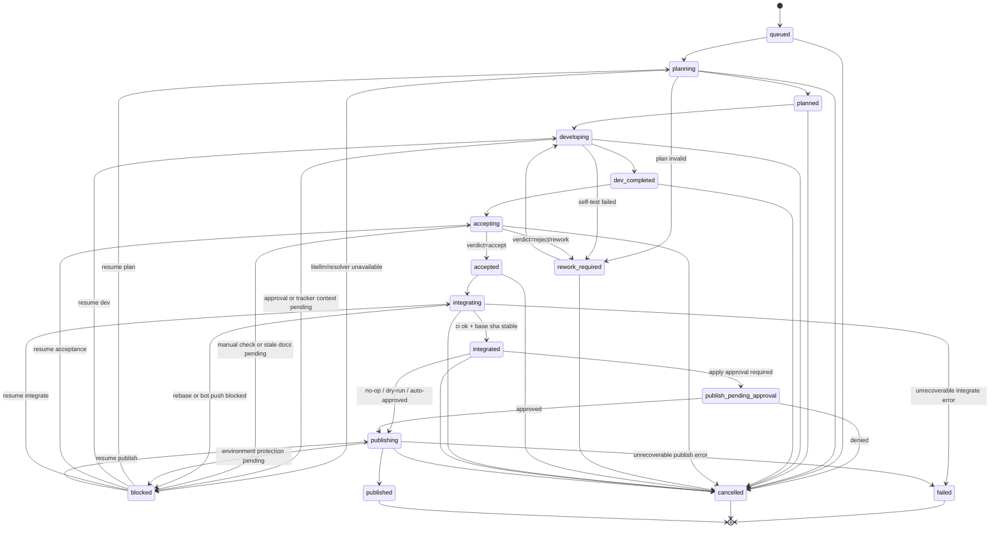

# shipyard-cp State Machine

## 目的

本書は [REQUIREMENTS.md](../REQUIREMENTS.md) を、実装可能な状態遷移モデルへ落とした補助仕様である。`main` 更新を `Integrate`、環境外副作用を `Publish` と分離し、LiteLLM と各ワーカーアダプタ、および `agent-taskstate` / `tracker-bridge-materials` / `memx-resolver` connector を含む Control Plane の責務境界を明確化する。

## OSS 境界

- `agent-taskstate`: Task / state transition / context bundle / typed_ref の canonical contract を提供する。
- `tracker-bridge-materials`: issue cache / entity link / sync event / context rebuild の helper layer を提供する。
- `memx-resolver`: docs resolve / chunks / reads ack / stale check / contract resolve の結果を提供する。

state machine は shipyard-cp 側にあるが、Task 識別と外部参照は canonical typed_ref で追跡し、docs 解決や tracker 連携は connector 経由で前提条件に組み込む。

## 状態一覧

| 状態 | 説明 | 主担当 |
|---|---|---|
| `queued` | Task 受付直後。未ディスパッチ。 | Control Plane |
| `planning` | Plan ワーカーが実行中。 | Worker |
| `planned` | 実行計画が確定。 | Control Plane |
| `developing` | Dev ワーカーが実装・自己テスト中。 | Worker |
| `dev_completed` | Dev の成果物が揃った。 | Control Plane |
| `accepting` | Acceptance ワーカーまたは手動検証中。 | Worker / Human |
| `accepted` | Acceptance 通過。Integrate へ進める。 | Control Plane |
| `rework_required` | 差し戻し。Dev へ戻す。 | Control Plane |
| `integrating` | integration branch 検証と main 更新を実行中。 | Control Plane |
| `integrated` | main 反映済み。Publish 実行前。 | Control Plane |
| `publish_pending_approval` | Publish Apply の承認待ち。 | Human / Policy |
| `publishing` | Publish 実行中。 | Control Plane |
| `published` | Publish 完了の終端状態。 | Control Plane |
| `cancelled` | 中断終端。 | Control Plane |
| `failed` | リトライ不能エラー終端。 | Control Plane |
| `blocked` | 外部依存や承認不足で停止。再開可能。 | Control Plane |

## 遷移ルール

### 正常系

1. `queued -> planning`
2. `planning -> planned`
3. `planned -> developing`
4. `developing -> dev_completed`
5. `dev_completed -> accepting`
6. `accepting -> accepted`
7. `accepted -> integrating`
8. `integrating -> integrated`
9. `integrated -> publish_pending_approval` if Publish Apply 承認が必要
10. `integrated -> publishing` if No-op / Dry-run / 自動承認済み
11. `publish_pending_approval -> publishing`
12. `publishing -> published`

### 差し戻し系

1. `planning -> rework_required` if 要件不備または Plan 不成立
2. `developing -> rework_required` if 自己テスト失敗かつ自動修復不可
3. `accepting -> rework_required` if 検収不合格
4. `rework_required -> developing` after 修正指示の再投入

### 停止・異常系

1. `planning -> blocked` if LiteLLM 障害、resolver 障害、または入力不足
2. `developing -> blocked` if 承認待ち escalation または tracker / resolver 補助情報不足
3. `accepting -> blocked` if 手動検証待ちまたは stale docs 再読待ち
4. `integrating -> blocked` if base SHA 競合または bot push 制限エラー
5. `publishing -> blocked` if environment protection rule 待ち
6. `* -> cancelled` if operator cancel
7. `* -> failed` if リトライ不能エラー
8. `blocked -> {planning|developing|accepting|integrating|publishing}` when 解消後に再開

## ガード条件

### 共通前提

- Task は `typed_ref` を 1 つ以上持ち、4 セグメント canonical form `<domain>:<entity_type>:<provider>:<entity_id>` に従う。
- tracker 参照を持つ場合は `tracker-bridge-materials` connector で解決可能な external ref を保持する。
- docs 参照を持つ場合は `memx-resolver` connector で `doc_id` / `chunk_ref` / `ack_ref` / `contract_ref` を解決可能であること。

### Plan

- `queued -> planning` には `task_id`, `repo_ref`, `objective` が最低限必要。
- Plan 開始前に、必要なら `memx-resolver` で docs resolve を実行し、必要 chunk を取得できること。
- `planning -> planned` には Plan 生成 artifact、または `verdict` が必要。

### Dev

- `planned -> developing` には `WorkerJob.stage = dev` と `capability_requirements` に `edit_repo` が必要。
- `developing -> dev_completed` には `WorkerResult.status = succeeded` かつ `patch_ref` または `branch_ref` が必要。
- tracker 補助情報が必要な Task では、`tracker-bridge-materials` connector 経由の issue cache / entity link が解決済みであること。
- `developing` 中の worker job には lease が発行され、heartbeat による生存確認ができること。

### Acceptance

- `dev_completed -> accepting` には raw artifact と test result が最低 1 件以上あること。
- `accepting -> accepted` には手動チェックログを含む `verdict.outcome = accept` が必要。
- 高リスク Task では `regression suite` の結果が `passed` でない限り `accepted` へ遷移できない。
- stale docs がある場合は `memx-resolver` の stale check が解消されるまで `accepted` へ進めない。

### Integrate

- `accepted -> integrating` には `branch_ref` または適用可能な `patch_ref`、`repo_ref.base_sha`、bot push 権限が必要。
- `accepted -> integrating` の前に、同一 branch または対象 resource に対する lock を取得できること。
- `integrating -> integrated` には integration branch 上の CI 成功、および `base SHA unchanged` の確認が必要。
- Integrate は人手レビューの代替ではなく、main 反映の統治ゲートとして機能する。
- `integrating` 中は lease または同等の実行監視を持ち、base SHA 競合や lock 競合時は `blocked` に進めることができる。

### Publish

- `integrated -> publishing` には `publish_plan` の生成済みと `idempotency_key` が必要。
- `integrated -> publish_pending_approval` は `publish_plan.approval_required = true` または environment protection rule が有効な場合に必須。
- `publishing -> published` には外部参照 ID（例: deployment id, release id, tag）が最低 1 つ必要。
- `published` は終端状態であり、後続遷移を持たない。
- `publishing` の開始前に対象 environment または publish target に対する lock を取得できること。
- `publishing` 中は lease または同等の実行監視を持ち、副作用の完了有無が不明な孤児化では `blocked` を優先する。

## 許可遷移一覧

API と監査イベントは、最低限次の遷移だけを許可する。

- `queued -> queued`
- `queued -> planning`
- `queued -> cancelled`
- `queued -> failed`
- `planning -> planned`
- `planning -> rework_required`
- `planning -> blocked`
- `planning -> cancelled`
- `planning -> failed`
- `planned -> developing`
- `planned -> cancelled`
- `planned -> failed`
- `developing -> dev_completed`
- `developing -> rework_required`
- `developing -> blocked`
- `developing -> cancelled`
- `developing -> failed`
- `dev_completed -> accepting`
- `dev_completed -> cancelled`
- `dev_completed -> failed`
- `accepting -> accepted`
- `accepting -> rework_required`
- `accepting -> blocked`
- `accepting -> cancelled`
- `accepting -> failed`
- `rework_required -> developing`
- `rework_required -> cancelled`
- `rework_required -> failed`
- `accepted -> integrating`
- `accepted -> cancelled`
- `accepted -> failed`
- `integrating -> integrated`
- `integrating -> blocked`
- `integrating -> cancelled`
- `integrating -> failed`
- `integrated -> publish_pending_approval`
- `integrated -> publishing`
- `integrated -> cancelled`
- `integrated -> failed`
- `publish_pending_approval -> publishing`
- `publish_pending_approval -> cancelled`
- `publish_pending_approval -> failed`
- `publishing -> published`
- `publishing -> blocked`
- `publishing -> cancelled`
- `publishing -> failed`
- `blocked -> planning`
- `blocked -> developing`
- `blocked -> accepting`
- `blocked -> integrating`
- `blocked -> publishing`
- `blocked -> cancelled`
- `blocked -> failed`

## Mermaid 図

## イベント設計の最小単位

状態遷移イベントは最低限次を持つ。

- `event_id`
- `task_id`
- `typed_ref`
- `from_state`
- `to_state`
- `actor_type`: `control_plane` / `worker` / `human` / `policy_engine`
- `actor_id`
- `reason`
- `job_id` optional
- `artifact_ids` optional
- `resolver_refs` optional
- `external_refs` optional
- `occurred_at`

## 実装メモ

- API 実装では、Task 本体の `state` に加えて最新の `active_job_id` と `last_verdict` を保持すると扱いやすい。
- `blocked` は単独状態だが、再開先は直前工程に依存するため、`blocked_context.resume_state` を別途保持するとよい。
- `publish_pending_approval` を独立状態にしておくと、GitHub Environments と人手承認の両方を同じ UI で扱える。
- `blocked_context` には `reason`, `resume_state`, `lock_conflict`, `capability_missing`, `loop_fingerprint` などの運用メタデータを保持できると扱いやすい。
- `agent-taskstate` / `tracker-bridge-materials` / `memx-resolver` の connector は state machine 本体と疎結合に保つ。
